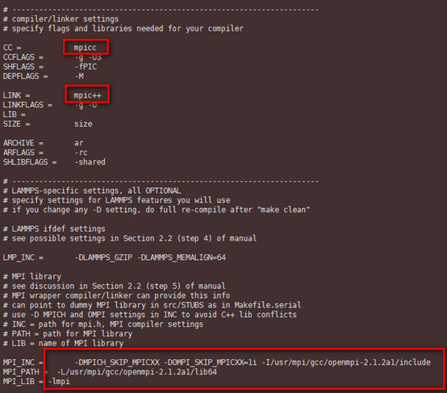
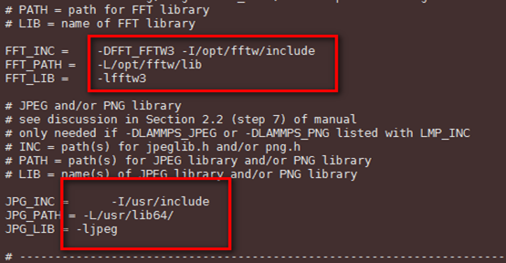
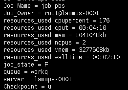
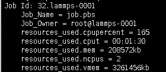
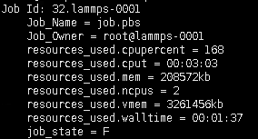

# HPC断点续算计算方案<a name="ZH-CN_TOPIC_0063547751"></a>

## 操作场景<a name="section921713611413"></a>

在HPC领域很多应用本身是支持断点续算功能的，例如LAMMPS， GROMACS。同时HPC常用的调度软件也对断点续算有集成支持，如PBS、Slurm与LSF等。

本节以LAMMPS为例，介绍如何在HPC进行断点续算。

## 步骤1 安装FFTW<a name="section4580079021513"></a>

依次执行以下命令，安装FFTW软件。

**yum install gcc-gfortran gcc-c++**

**wget http://www.fftw.org/fftw-3.3.8.tar.gz**

**export LD\_LIBRARY\_PATH=$LD\_LIBRARY\_PATH:/usr/mpi/gcc/_openmpi-2.1.2a1_/lib64/**

**export PATH=/usr/mpi/gcc/_openmpi-2.1.2a1_/bin:$PATH**

**tar -zxvf fftw-3.3.8.tar.gz**

**cd fftw-3.3.8/**

**./configure --prefix=/opt/fftw CC=gcc MPICC=mpicc --enable-mpi --enable-openmp --enable-threads --enable-avx --enable-shared**

**make && make install**

## 步骤2 安装lammps<a name="section1259573114108"></a>

1.  依次执行以下命令，安装lammps。

    **yum install libjpeg-\***

    **yum install libpng12-\***

    **wget https://lammps.sandia.gov/tars/lammps-2Aug18.tar.gz**

    **tar -zxvf lammps-2Aug18.tar.gz**

    **cd lammps-2Aug18/src**

    **vi MAKE/Makefile.mpi**

2.  根据[图1](#fig1670593481617)、[图2](#fig1839610363177)，修改红框标识中的内容。其中，版本号需根据实际情况进行填写。

    > **须知：**   
    >只修改[图1](#fig1670593481617)、[图2](#fig1839610363177)中红框标识的内容。  

    **图 1**  修改Makefile文件01<a name="fig1670593481617"></a>  
    

    **图 2**  修改Makefile文件02<a name="fig1839610363177"></a>  
    

3.  执行以下命令，编译lammps，并将当前目录生成的lmp\_mpi文件拷贝至“/share“目录。

    **make mpi**


## 步骤3 配置lammps<a name="section112342141215"></a>

1.  算例输入文件。

    以melt为例，生成一个算例melt.in文件。设置每迭代100步生成一个checkpoint文件，假定该文件存放在共享目录“/share“中。内容如下：

    ```
    # 3d Lennard-Jones melt
     
    units           lj
    atom_style      atomic
     
    lattice         fcc 0.8442
    region          box block 0 20 0 20 0 20
    create_box      1 box
    create_atoms    1 box
    mass            1 1.0
     
    velocity        all create 1.44 87287 loop geom
     
    pair_style      lj/cut 2.5
    pair_coeff      1 1 1.0 1.0 2.5
     
    neighbor        0.3 bin
    neigh_modify    delay 5 every 1
     
    fix             1 all nve
    dump 1 all xyz 100 /share/sample.xyz
    run             10000 every 100 "write_restart /share/lennard.restart"
    ```

2.  生成用于checkpoint续算的输入文件“melt.restart.in”，内容如下：

    ```
    # 3d Lennard-Jones melt
     
    read_restart  /share/lennard.restart
    run        10000 every 100 "write_restart /share/lennard.restart"
    ```

3.  生成pbs作业脚本“job.pbs”，内容如下：

    ```
    #!/bin/sh
    #PBS -l ncpus=2
    #PBS -o lammps_pbs.log
    #PBS -j oe
     
    export PATH=/usr/mpi/gcc/openmpi-2.1.2a1/bin:$PATH
     
    export LD_LIBRARY_PATH=$LD_LIBRARY_PATH:/usr/mpi/gcc/openmpi-2.1.2a1/lib64/module 
     
    if [ ! -e "/share/lennard.restart" ]; then
      echo "run at the beginning"
      mpiexec --allow-run-as-root -np 2 /share/lmp_mpi -in /share/melt.in
    else
      echo "run from the last checkpoint"
      mpiexec --allow-run-as-root -np 2 /share/lmp_mpi -in /share/melt.restart.in
    fi
    ```


## 步骤4 提交作业，且运行期间无中断<a name="section55282050132419"></a>

在不中断作业的情况下，提交作业并运行，查看作业运行时间。

1.  执行以下命令，提交作业。

    **qsub job.pbs**

2.  作业运行结束后，执行以下命令，查看作业信息。

    **qstat -f  _作业ID_**

    如[图3](#fig2095102534913)所示，可以看到作业一共运行了4分10秒。

    **图 3**  运行作业不中断<a name="fig2095102534913"></a>  
    


## 步骤5 提交作业，模拟计算中断，使用断点续算模式完成计算<a name="section49891564253"></a>

模拟作业中断情况：提交作业后，通过关机计算节点的方式手动中断作业，查看中断前、后作业运行时间。

1.  执行以下命令，提交作业。

    **qsub job.pbs**

2.  <a name="li952011016404"></a>作业运行1分30秒左右，关机作业运行的计算节点，模拟算例释放场景。
3.  执行以下命令，查看关闭计算节点后的作业信息。

    **qstat -f  _作业ID_**

    **图 4**  中断前作业信息<a name="fig517165265618"></a>  
    

    此时，pbs作业回到queued状态，等待可用的计算资源。

4.  开机[2](#li952011016404)中关闭的计算节点，提供可用的计算资源。

    此时，pbs作业会继续进行。

5.  作业执行完成后，执行以下命令，查看作业信息。

    **qstat -f  _作业ID_**

    如[图5](#fig5673133818216)所示，作业运行了3分03秒。由此可以看出，作业是从断点的位置进行续算的。

    **图 5**  中断后运行作业信息<a name="fig5673133818216"></a>  
    


