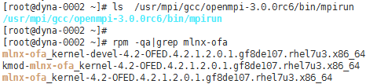
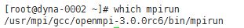

# IB驱动自带的OpenMPI<a name="ZH-CN_TOPIC_0063425436"></a>

## 操作场景<a name="section5226638417947"></a>

本节指导用户安装和使用IB驱动自带的OpenMPI（以版本3.0.0rc6为例）。

## 前提条件<a name="section22262618171127"></a>

已配置弹性云服务器免密登录。

## 操作步骤<a name="section54197928171645"></a>

1.  检查是否已安装IB驱动。
    1.  使用“PuTTY”，采用密钥对方式登录弹性云服务器。
    2.  执行以下命令，切换为root 用户。

        **$ sudo su**

    3.  执行以下命令，防止系统超时退出。

        **\# TMOUT=0**

    4.  执行以下命令，查询是否已安装IB驱动。

        **\# rpm -qa | grep mlnx-ofa**

        **\# ls  /usr/mpi/gcc/openmpi-**3.0.0rc6**/bin/mpirun**

        **图 1**  已安装IB驱动<a name="zh-cn_topic_0062552876_fig5899822121240"></a>  
        

        -   如果上述两条命令均有如[图1](#zh-cn_topic_0062552876_fig5899822121240)所示的返回值，则已安装IB驱动，执行[3](#li8761273191930)。
        -   如果返回值与[图1](#zh-cn_topic_0062552876_fig5899822121240)不同，表示弹性云服务器未安装IB驱动，执行[2](#zh-cn_topic_0062552876_li3820510221542)。

2.  <a name="zh-cn_topic_0062552876_li3820510221542"></a>下载并安装对应的IB驱动。

    在Mellanox官网[http://www.mellanox.com/page/products\_dyn?product\_family=26&mtag=linux\_sw\_drivers](http://www.mellanox.com/page/products_dyn?product_family=26&mtag=linux_sw_drivers)，选择相应版本的InfiniBand网卡驱动下载，并根据Mellanox提供的操作指导进行安装。

    以操作系统CentOS 7.3为例，推荐安装4.2.1版本的安装包，下载安装包“MLNX\_OFED\_LINUX-4.2-1.2.0.0-rhel7.3-x86\_64.tgz”，并执行以下命令进行安装：

    **\# yum install tk tcl**

    **\# tar -xvf MLNX\_OFED\_LINUX-4.2-1.2.0.0-rhel7.3-x86\_64.tgz**

    **\# cd MLNX\_OFED\_LINUX-4.2-1.2.0.0-rhel7.3-x86\_64/**

    **\# ./mlnxofedinstall**

3.  <a name="li8761273191930"></a>配置环境变量。
    1.  执行以下命令，使用vim编辑“\~/.bashrc“文件，添加如下配置内容。

        **export PATH=$PATH:/usr/mpi/gcc/openmpi-3.0.0rc6/bin**

        **export LD\_LIBRARY\_PATH=/usr/mpi/gcc/openmpi-3.0.0rc6/lib64**

    2.  执行以下命令，导入配置的MPI环境变量。

        **\# source \~/.bashrc**

    3.  执行以下命令，查看MPI环境变量是否正常。

        **\# which mpirun**

        **图 2**  查看MPI环境变量<a name="fig14183907112719"></a>  
        

        系统回显结果如[图2](#fig14183907112719)所示，则环境配置正常。

4.  执行以下命令，在单个弹性云服务器上运行Intel MPI benchmark。

    **\# mpirun --allow-run-as-root -np 2 /usr/mpi/gcc/openmpi-3.0.0rc6/tests/imb/IMB-MPI1 PingPong**

    系统回显如下：

    ```
    #------------------------------------------------------------
    #    Intel (R) MPI Benchmarks 4.1, MPI-1 part
    #------------------------------------------------------------
    # Date                  : Mon Jul 16 10:11:14 2018
    # Machine               : x86_64
    # System                : Linux
    # Release               : 3.10.0-514.10.2.el7.x86_64
    # Version               : #1 SMP Fri Mar 3 00:04:05 UTC 2017
    # MPI Version           : 3.1
    # MPI Thread Environment:
    
    # New default behavior from Version 3.2 on:
    
    # the number of iterations per message size is cut down
    # dynamically when a certain run time (per message size sample)
    # is expected to be exceeded. Time limit is defined by variable
    # "SECS_PER_SAMPLE" (=> IMB_settings.h)
    # or through the flag => -time
    
    
    # Calling sequence was:
    
    # /usr/mpi/gcc/openmpi-3.0.0rc6/tests/imb/IMB-MPI1 PingPong
    
    # Minimum message length in bytes:   0
    # Maximum message length in bytes:   4194304
    #
    # MPI_Datatype                   :   MPI_BYTE
    # MPI_Datatype for reductions    :   MPI_FLOAT
    # MPI_Op                         :   MPI_SUM
    #
    #
    
    # List of Benchmarks to run:
    
    # PingPong
    
    #---------------------------------------------------
    # Benchmarking PingPong
    # #processes = 2
    #---------------------------------------------------
    #bytes #repetitions      t[usec]   Mbytes/sec
    0         1000         0.24         0.00
    1         1000         0.25         3.89
    2         1000         0.23         8.17
    4         1000         0.23        16.25
    8         1000         0.23        32.48
    16         1000         0.23        65.98
    32         1000         0.26       115.35
    64         1000         0.26       232.92
    128         1000         0.38       320.59
    256         1000         0.44       554.35
    512         1000         0.54       902.98
    1024         1000         0.64      1537.63
    2048         1000         0.85      2298.79
    4096         1000         1.28      3057.93
    8192         1000         2.28      3426.14
    16384         1000         1.41     11052.14
    32768         1000         2.05     15218.39
    65536          640         3.31     18882.34
    131072          320         6.57     19036.27
    262144          160        15.12     16535.96
    524288           80        32.90     15195.74
    1048576           40        64.62     15476.02
    2097152           20       122.83     16282.06
    4194304           10       242.95     16463.95
    
    # All processes entering MPI_Finalize
    ```


