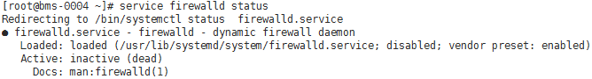
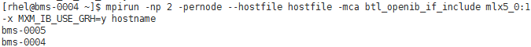
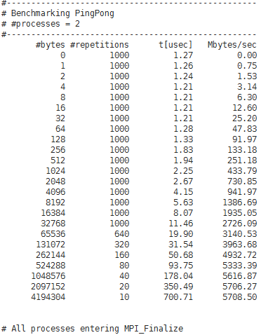

# IB驱动自带的OpenMPI（BMS场景）

## 操作场景

该任务指导用户在BMS集群上运行IB驱动自带的MPI应用（3.1.0rc2版本）。

## 前提条件

-   已配置BMS集群间互相免密登录。
-   集群中所有的BMS，均已安装IB驱动自带的OpenMPI。

## 操作步骤

1.  关闭防火墙。
    1.  登录集群中任意一台BMS。
    2.  执行以下命令，关闭BMS防火墙。

        **\# service firewalld stop**

        **\# iptables -F**

    3.  执行以下命令，查看防火墙是否关闭成功。

        **\#** **service** ****firewalld**** **status**

        **图 1**  确认关闭防火墙成功  
        

    4.  依次登录集群中所有BMS，重复执行[1.b](#li51422230163750)～[1.c](#li5396046517726)，关闭所有BMS的防火墙。

2.  修改配置文件。
    1.  登录集群中任意一台BMS。
    2.  执行以下命令，查看BMS的主机名。

        **$ hostname**

        **图 2**  查看BMS的主机名  
        

    3.  依次登录集群中所有BMS，重复执行[1.b](#li51422230163750)～[2.b](#li11569509163750)，获取所有BMS的主机名。
    4.  登录集群中任意一台BMS。
    5.  执行以下命令，添加hosts配置文件。

        **\# vi /etc/hosts**

        添加的内容为集群中所有BMS的私网IP和主机名，例如：

        **192.168.0.1 bms-0004**

        **192.168.0.2 bms-0005**

        **...**

    6.  执行以下命令，添加hostfile文件。

        **$vi hostfile**

        添加集群中所有BMS的主机名，例如：

        **bms-0004**

        **bms-**0005****

        **...**

    7.  依次登录集群中所有BMS，重复执行[2.e](#li46796809163750)～[2.f](#li36261981163750)。

3.  运行MPI benchmark。
    1.  在任意一台BMS中执行以下命令，检验hostfile文件是否配置成功。

        **$ mpirun -np 2 -pernode --hostfile hostfile -mca btl\_openib\_if\_include "mlx5\_0:1" -x MXM\_IB\_USE\_GRH=y hostname**

        **图 3**  检查配置文件  
        

        回显如[图3](#fig13290425163715)所示，显示集群中所有BMS的主机名，则表示hostfile文件配置成功。

    2.  在任意一台BMS中执行以下命令，运行MPI benchmark，运行时指定hostfile路径。

        以两个BMS为例：

        ****$**** ****mpirun**** **-np 2 -pernode --hostfile hostfile -mca btl\_openib\_if\_include "mlx5\_0:1" -x MXM\_IB\_USE\_GRH=y /usr/mpi/gcc/openmpi-3.1.0rc2/tests/imb/IMB-MPI1 PingPong**

        **图 4**  集群运行IB驱动自带OpenMPI  
        

        系统回显如[图4](#fig21754518163715)所示，表示集群上运行IB驱动自带的OpenMPI成功。

