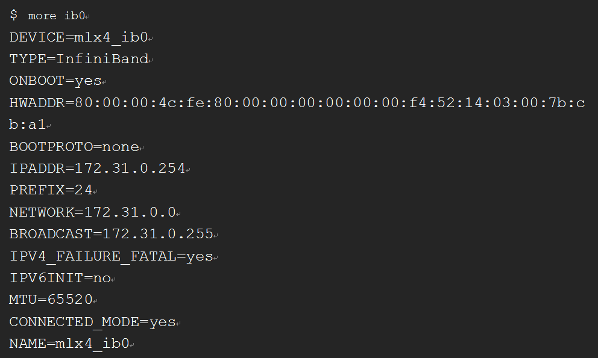

# IPoIB功能简介

## 什么是IPoIB

IPoIB（Internet Protocol over InfiniBand），指利用物理IB网络（包括服务器上的IB卡、IB连接线、IB交换机等）通过IP协议进行连接，并进行数据传输。

它提供了基于RDMA之上的IP网络模拟层，允许应用无修改的运行在Infiniband网络上。但是，IPoIB性能比RDMA通信方式性能要低，大多数应用都会采用RDMA方式获取高带宽低延时的收益，少数的关键应用会采用IPoIB方式通信。

> **说明：**   
>无修改：指运行在IP协议上的应用不需要作任何修改，即可适配IB网络运行。  

## IPoIB的通信模式有哪些

IPoIB设备能够配置为datagram和connected两种模式，前者提供不可靠的、无连接的链路，后者提供可靠的、有连接的链路。

-   在datagram模式下，queue pair不允许报文大小超过IB链路层的MTU值，由于IPoIB头还包含了4字节，因此IPoIB的MTU值要小于IB链路层的MTU值。
-   在connected模式下，queue pair允许发送比IB链路层更大的报文，理论上可以发送大小65535长度的报文。 connected模式具有更好的性能，但是会消耗系统更多的内存。多数系统更关注性能，因此大多数场景下IB网口配置为connected模式。

当前版本的网卡驱动不支持connected模式。

> **说明：**   
>由于网卡驱动性能原因，系统关闭了connected模式，因此，当前版本网卡驱动不支持配置connected模式。  

## IPoIB的IP地址分配方式有哪些

有两种IP地址分配方式：静态配置和DHCP动态配置。

-   静态配置：

    IPoIB设备有20个字节的硬件地址，前4个字节是queue pair number，中间8个字节是子网前缀，最后8个字节是guid。

    IPoIB设备的硬件地址只能通过ip命令查询，ifconfig查询不到完整地址。静态IP地址配置举例如下：

    **图 1**  静态IP地址配置  
    

-   DHCP动态配置：

    标准的DHCP帧格式包括了硬件类型（htype）、硬件地址长度（ hlen）、 硬件地址（chaddr）等字段。由于MAC地址字段的长度不能容纳IPoIB的硬件地址，因此定义client-identifier字段来标识client端dhcp会话。该client-identifier用于IP地址和client关联，DHCP Server根据该标识来区分客户端分配IP地址。

    HPC解决方案当前采用的是DHCP方式的IPoIB方案，实现IP地址自动化发放和配置。

## IPoIB的约束和限制

-   支持管理一个IB网卡。
-   继承BMS、H2型、HL1型、HI3型云服务器对IB网卡的使用约束与限制，使用IPoIB特性的弹性云服务器不支持迁移。
-   继承H2型、HL1型、HI3型云服务器对IB网卡的使用约束与限制，使用的IB网络不支持安全组、Qos、三层及以上网络功能。
-   受限于网卡驱动限制，使用IPoIB特性的弹性云服务器不支持anti arp-spoofing、dhcp-spoofing。

