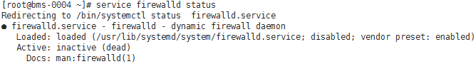

# Intel MPI（BMS场景）

## 操作场景

该任务指导用户在BMS集群上运行Intel MPI应用（l\_mpi\_2017.3.196版本）。

## 前提条件

-   已配置BMS集群间互相免密登录。
-   集群中所有的BMS，均已安装Spectrum MPI。

## 操作步骤

1.  关闭防火墙。
    1.  登录集群中任意一台BMS。
    2.  执行以下命令，关闭BMS防火墙。

        **\# service firewalld stop**

        **\# iptables -F**

    3.  执行以下命令，查看防火墙是否关闭成功。

        **\#** **service** ****firewalld**** **status**

        **图 1**  确认关闭防火墙成功  
        

    4.  依次登录集群中所有BMS，重复执行[1.b](#zh-cn_topic_0075662283_li51422230163750)～[1.c](#zh-cn_topic_0075662283_li5396046517726)，关闭所有BMS的防火墙。

2.  修改配置文件。
    1.  登录集群中任意一台BMS。
    2.  执行以下命令，查看BMS的主机名。

        **$ hostname**

        **图 2**  查看BMS的主机名  
        

    3.  依次登录集群中所有BMS，重复执行[1.b](IB驱动自带的OpenMPI（BMS场景）.md#li51422230163750)～[2.b](#zh-cn_topic_0075662283_li11569509163750)，获取所有BMS的主机名。
    4.  登录集群中任意一台BMS。
    5.  执行以下命令，添加hosts配置文件。

        **\# vi /etc/hosts**

        添加的内容为集群中所有BMS的私网IP和主机名，例如：

        **192.168.0.1 bms-0004**

        **192.168.0.2 bms-0005**

        **...**

    6.  执行以下命令，添加hostfile文件。

        **$vi hostfile**

        添加集群中所有BMS的主机名，例如：

        **bms-0004**

        **bms-**0005****

        **...**

    7.  依次登录集群中所有BMS，重复执行[2.e](#zh-cn_topic_0075662283_li46796809163750)～[2.f](#zh-cn_topic_0075662283_li36261981163750)。

3.  执行以下命令，在BMS集群运行Intel MPI。

    以两台BMS为例：

    **$ mpirun -perhost 2 -np 12 -machinefile hostfile /home/rhel/hello**

    **图 3**  BMS集群上运行Intel MPI成功  
    

    > **说明：**   
    >hostfile文件在运行时需要指定路径，可执行文件hello路径须为绝对路径，集群中所有可执行文件在同一路径下。  

