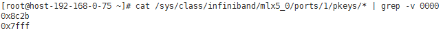
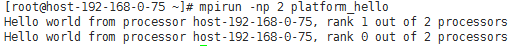

# Platform MPI

## 操作场景

本节指导用户在ECS上安装和使用Platform MPI应用（以版本platform\_mpi-09.01.04.03r-ce为例）。

## 前提条件

已配置弹性云服务器免密登录。

## 操作步骤

1.  安装Platform MPI。
    1.  执行以下命令，安装需要的库文件。

        **\# yum install glibc.i686 libgcc-4.8.5-11.el7.i686**

    2.  增加执行权限，例如安装包所在路径为/root。

        **\# cd /root && chmod +x platform\_mpi- 09.01.04.03r-ce.bin**

    3.  执行以下命令，安装Platform MPI。

        \#  **./platform\_mpi- 09.01.04.03r-ce.bin**

        按照提示输入Enter或1（accept the agreement）直到安装完成，以下为安装成功界面。

        **图 1**  Platform MPI安装成功  
        

        默认安装路径为/opt/ibm/platform\_mpi。

2.  配置MPI环境变量。
    1.  执行以下命令，获取pkey。

        **\# cat /sys/class/infiniband/mlx5\_0/ports/1/pkeys/\* | grep -v 0000**

        **图 2**  查询pkey值  
        

    2.  普通用户下，在\~/.bashrc中添加如下语句：

        **export MPI\_ROOT=/opt/ibm/platform\_mpi**

        **export PATH=$MPI\_ROOT/bin:$PATH**

        **export LD\_LIBRARY\_PATH=/opt/ibm/platform\_mpi/lib/linux\_amd64**

        **export MPI\_IB\_PKEY=**_[步骤2.1](#li43811143171922)__中获取的pkey_

        **$source  \~/.bashrc**

        > **说明：**   
        >如果存在多个pkey，使用英文逗号隔开。  

    3.  执行以下命令，检查环境变量是否配置成功。

        **\# which mpirun**

        **图 3**  Platform MPI环境变量导入成功  
        

3.  执行下列命令，在单个ECS上运行Platform MPI。
    1.  执行以下命令，重新编译hello.c文件。

        **\# mpicc hello.c -o platform\_hello**

    2.  执行以下命令，在单个BMS上运行Platform MPI。

        **\# mpirun -np 2 /root/**platform\_hello****

        **图 4**  在单个BMS上运行Platform MPI  
        

