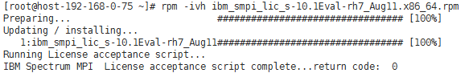
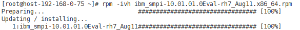
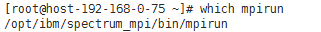
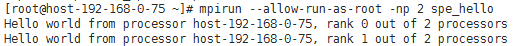

# Spectrum MPI<a name="ZH-CN_TOPIC_0064066056"></a>

## 操作场景<a name="section5226638417947"></a>

本节指导用户安装和使用IBM Spectrum MPI（以IBM Spectrum MPI v10.1为例）。

其中，IBM Spectrum MPI v10.1版本当前支持的操作系统列表如下：

-   **IBM Spectrum MPI 10.1.0.1 Eval for x86\_64 Linux**
    -   Red Hat Enterprise Linux version 6.6及其之后的版本
    -   Red Hat Enterprise Linux version 7.1及其之后的版本
    -   SUSE Linux Enterprise Server version 11 SP4
    -   SUSE Linux Enterprise Server version 12及其之后的版本

-   **IBM Spectrum MPI 10.1.0.2 Eval for Power 8 Linux**
    -   Red Hat Enterprise Linux version 7.3及其之后的版本


## 前提条件<a name="section22262618171127"></a>

已配置弹性云服务器免密登录。

## 操作步骤<a name="section54197928171645"></a>

1.  <a name="li53636217498"></a>获取软件包。
    1.  获取IBM Spectrum MPI软件包。

        下载地址：[https://www-01.ibm.com/marketing/iwm/iwm/web/preLogin.do?source=swerpsysz-lsf-3](https://www-01.ibm.com/marketing/iwm/iwm/web/preLogin.do?source=swerpsysz-lsf-3)

        获取的软件包一般为两个，包括license和软件两部分，例如，获取的IBM Spectrum MPI软件包为：

        **smpi\_lic\_s-10.1Eval-rh7\_Sep15.x86\_64.rpm**

        **ibm\_smpi-10.1.0.3eval\_170901-rh7\_Apr11.x86\_64.rpm**

    2.  下载需要的HPC-X工具套件。

        IBM MPI在EDR SR-IOV场景下的运行需要HPC-X提供的MXM库的支持，HPC-X 的下载需要参考弹性云服务器操作系统的版本以及IB驱动版本，例如，下载的HPC-X版本为：hpcx-v2.0.0-gcc-MLNX\_OFED\_LINUX-4.2-1.2.0.0-redhat7.3-x86\_64.tbz。

        下载地址：[http://www.mellanox.com/page/products\_dyn?product\_family=189&mtag=hpc-x](http://www.mellanox.com/page/products_dyn?product_family=189&mtag=hpc-x)

2.  安装HPC-X工具套件。
    1.  将[1](#li53636217498)中下载的HPC-X压缩包上传至运行MPI的弹性云服务器内。
    2.  执行以下命令，解压HPC-X工具套件。

        **$ tar xvf hpcx-v2.0.0-gcc-MLNX\_OFED\_LINUX-4.2-1.2.0.0-redhat7.3-x86\_64.tbz**

    3.  执行以下命令，设置HPC-X环境变量。

        **$ cd hpcx-v2.0.0-gcc-MLNX\_OFED\_LINUX-4.2-1.2.0.0-redhat7.3-x86\_64**

        **$ export HPCX\_HOME=$PWD**

3.  安装IBM Spectrum MPI。
    1.  将[1](#li53636217498)中下载的MPI软件包上传至运行MPI的弹性云服务器内。
    2.  执行以下命令，切换至root用户。

        **$ sudo su -**

    3.  执行以下命令，设置环境变量。
        -   如果选择自动接受IBM Spectrum MPI安装许可协议，执行以下命令：

            **\# export IBM\_SPECTRUM\_MPI\_LICENSE\_ACCEPT=yes**

        -   如果选择手动接受IBM Spectrum MPI安装许可协议，执行以下命令：

            **\# export IBM\_SPECTRUM\_MPI\_LICENSE\_ACCEPT=no**

    4.  安装License部分。
        -   选择自动接受IBM Spectrum MPI安装许可协议的，执行以下命令：

            **\# rpm -ivh smpi\_lic\_s-10.1Eval-rh7\_Sep15.x86\_64.rpm**

        -   选择手动接受IBM Spectrum MPI安装许可协议的，执行以下命令：

            **\# rpm -ivh ibm\_smpi\_lic\_s-10.1Eval-rh7\_Sep15.x86\_64.rpm**

            **图 1**  手动接受IBM Spectrum MPI安装协议<a name="fig1951015514363"></a>  
            

            并根据界面提示，执行以下命令，运行脚本：

            **\# sh /opt/ibm/spectrum\_mpi/lap\_se/bin/accept\_spectrum\_mpi\_license.sh**

    5.  执行以下命令，安装软件部分。

        **\# rpm -ivh ibm\_smpi-10.1.0.3eval\_170901-rh7\_Apr11.x86\_64.rpm**

        **图 2**  安装软件<a name="fig3493182311374"></a>  
        

4.  配置MPI环境变量。
    1.  默认情况下，Spectrum MPI会安装至“/opt/ibm/spectrum\_mpi“目录。该场景下需要设置如下环境变量：

        **export MPI\_ROOT=/opt/ibm/spectrum\_mpi**

        **export LD\_LIBRARY\_PATH=$MPI\_ROOT/lib:$LD\_LIBRARY\_PATH**

        **export PATH=$MPI\_ROOT/bin:$PATH**

        **export MANPATH=$MPI\_ROOT/share/man:$MANPATH**

        **unset MPI\_REMSH**

    2.  执行以下命令，查看环境变量导入是否成功。

        ****\#**  which mpirun**

        **图 3**  查看环境变量<a name="fig98833323717"></a>  
        

5.  执行以下命令，在单个弹性云服务器上通过Spectrum MPI运行可执行文件。
    1.  执行以下命令，编辑文件。

        ****\#**  cd**

        ****\#**  vi hello.c**

        编辑内容如下：

        ```
        #include<mpi.h>
        #include<stdio.h>
        int main(intargc, char**argv){
        //Initialize the MPI environment
        MPI_Init(NULL, NULL);
        //Get the number of processes
        int world_size;
        MPI_Comm_size(MPI_COMM_WORLD, &world_size);
        //Get the rank of the process
        int world_rank;
        MPI_Comm_rank(MPI_COMM_WORLD, &world_rank);
        //Get the name of the processor
        char processor_name[MPI_MAX_PROCESSOR_NAME];
        int name_len;
        MPI_Get_processor_name(processor_name, &name_len);     
        //Print off a hello world message
        printf("Hello world from processor %s, rank %d"" out of %d processors\n",      processor_name, world_rank, world_size);
        //FinalizetheMPIenvironment.
        MPI_Finalize();
        }
        ```

    2.  执行以下命令，生成可执行文件，假设在/home/linux目录下生成。

        ****\#**  mpicc hello.c -o spe\_hello**

        > **说明：**   
        >不同版本的MPI运行的hello文件是不同的，因此，如果更换了MPI版本，需要重新执行命令**\#** **mpicc hello.c -o spe\_hello**进行编译，生成新的可执行文件。  

    3.  执行以下命令，在单个ECS上运行Spectrum MPI。

        **\# mpirun  --allow-run-as-root -np 2 /root/spe\_hello**

        系统回显如[图4](#fig19771132916510)所示。

        **图 4**  运行结果<a name="fig19771132916510"></a>  
        


