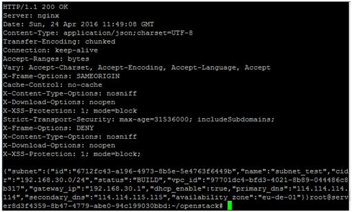

# 创建支持IB网卡的弹性云服务器<a name="ZH-CN_TOPIC_0062552879"></a>

## 操作场景<a name="section56973548163642"></a>

您可以在几分钟之内快速获得基于公有云平台的弹性云服务器设施，并且这些设施是弹性的，可以根据需求伸缩。该任务指导用户如何创建支持IB网卡的弹性云服务器，包括管理控制台方式和基于HTTPS请求的API（Application programming interface）方式。

H2型、HI3型弹性云服务器使用带宽100Gb/s的IB网卡，更多关于H2型、HI3型弹性云服务器的使用方法与介绍，请参见《弹性云服务器用户指南》的“产品介绍 \> 实例和应用场景”章节。

## 控制台方式<a name="section20561905163651"></a>

1.  登录管理控制台。
2.  选择“计算 \> 弹性云服务器”。

    进入弹性云服务器信息页面。

3.  单击“创建弹性云服务器”，开始创建弹性云服务器。
4.  根据[表1](#tb58ee32bf2d847dbb10ef66ba82ce6cf)，填写待创建弹性云服务器的基本信息。

    **表 1**  参数说明

    <a name="tb58ee32bf2d847dbb10ef66ba82ce6cf"></a>
    <table><thead align="left"><tr id="rec12c316f55f40bbb90104deaddef986"><th class="cellrowborder" valign="top" width="22.430000000000003%" id="mcps1.2.4.1.1"><p id="aee87334ef5d64ddfb34527f260285a08"><a name="aee87334ef5d64ddfb34527f260285a08"></a><a name="aee87334ef5d64ddfb34527f260285a08"></a>参数</p>
    </th>
    <th class="cellrowborder" valign="top" width="59.09000000000001%" id="mcps1.2.4.1.2"><p id="ac308a1cc7c0443c29345c95f265856eb"><a name="ac308a1cc7c0443c29345c95f265856eb"></a><a name="ac308a1cc7c0443c29345c95f265856eb"></a>解释</p>
    </th>
    <th class="cellrowborder" valign="top" width="18.48%" id="mcps1.2.4.1.3"><p id="aa772004913e44a69b260dbf3ba141d6c"><a name="aa772004913e44a69b260dbf3ba141d6c"></a><a name="aa772004913e44a69b260dbf3ba141d6c"></a>取值样例</p>
    </th>
    </tr>
    </thead>
    <tbody><tr id="row1239117345201"><td class="cellrowborder" valign="top" width="22.430000000000003%" headers="mcps1.2.4.1.1 "><p id="p1839173422014"><a name="p1839173422014"></a><a name="p1839173422014"></a>区域</p>
    </td>
    <td class="cellrowborder" valign="top" width="59.09000000000001%" headers="mcps1.2.4.1.2 "><p id="p53913340205"><a name="p53913340205"></a><a name="p53913340205"></a>如果所在区域不正确，请单击页面左上角的<a name="image1456712104154"></a><a name="image1456712104154"></a><span></span>进行切换。</p>
    </td>
    <td class="cellrowborder" valign="top" width="18.48%" headers="mcps1.2.4.1.3 "><p id="p144717414213"><a name="p144717414213"></a><a name="p144717414213"></a>华南</p>
    </td>
    </tr>
    <tr id="re5fef4b628c14f048d7fae1e736a9733"><td class="cellrowborder" valign="top" width="22.430000000000003%" headers="mcps1.2.4.1.1 "><p id="af2823ed0b47e41f799680025fdf51b77"><a name="af2823ed0b47e41f799680025fdf51b77"></a><a name="af2823ed0b47e41f799680025fdf51b77"></a>可用区</p>
    </td>
    <td class="cellrowborder" valign="top" width="59.09000000000001%" headers="mcps1.2.4.1.2 "><p id="p1427163872112"><a name="p1427163872112"></a><a name="p1427163872112"></a>指在同一地域下，电力、网络隔离的物理区域，可用分区之内内网互通，不同可用分区之间物理隔离。</p>
    <a name="ul53271910224"></a><a name="ul53271910224"></a><ul id="ul53271910224"><li>如果您需要提高应用的高可用性，建议您将云服务器创建在不同的可用分区。</li><li>如果您需要较低的网络时延，建议您将弹性云服务器创建在相同的可用区。</li></ul>
    </td>
    <td class="cellrowborder" valign="top" width="18.48%" headers="mcps1.2.4.1.3 "><p id="p52298119165041"><a name="p52298119165041"></a><a name="p52298119165041"></a>az-01</p>
    </td>
    </tr>
    <tr id="rb4f974fb791a4ecd8fd52dd4c8f0bfd4"><td class="cellrowborder" valign="top" width="22.430000000000003%" headers="mcps1.2.4.1.1 "><p id="p11794182172215"><a name="p11794182172215"></a><a name="p11794182172215"></a>规格</p>
    </td>
    <td class="cellrowborder" valign="top" width="59.09000000000001%" headers="mcps1.2.4.1.2 "><p id="p19255189343"><a name="p19255189343"></a><a name="p19255189343"></a>选择H2或HI3型弹性云服务器。</p>
    </td>
    <td class="cellrowborder" valign="top" width="18.48%" headers="mcps1.2.4.1.3 "><p id="zh-cn_topic_0013859510_p228601711836"><a name="zh-cn_topic_0013859510_p228601711836"></a><a name="zh-cn_topic_0013859510_p228601711836"></a>h2.4xlarge.8</p>
    </td>
    </tr>
    <tr id="r88c06ddd61b34a8baf7ff7483c83a666"><td class="cellrowborder" valign="top" width="22.430000000000003%" headers="mcps1.2.4.1.1 "><p id="a073ced63ae6e4c28864b1b7d9c6eecfb"><a name="a073ced63ae6e4c28864b1b7d9c6eecfb"></a><a name="a073ced63ae6e4c28864b1b7d9c6eecfb"></a>专属主机</p>
    </td>
    <td class="cellrowborder" valign="top" width="59.09000000000001%" headers="mcps1.2.4.1.2 "><p id="p60779722142633"><a name="p60779722142633"></a><a name="p60779722142633"></a>不涉及该参数。</p>
    <p id="a9bc262f2adef4193ac808dceba7d7d37"><a name="a9bc262f2adef4193ac808dceba7d7d37"></a><a name="a9bc262f2adef4193ac808dceba7d7d37"></a>HPC为单主机单个弹性云服务器场景，用户无需指定专属主机。</p>
    </td>
    <td class="cellrowborder" valign="top" width="18.48%" headers="mcps1.2.4.1.3 "><p id="aea863d9129dd4759a8ea9f20cf628d6d"><a name="aea863d9129dd4759a8ea9f20cf628d6d"></a><a name="aea863d9129dd4759a8ea9f20cf628d6d"></a>-</p>
    </td>
    </tr>
    <tr id="r6fc77c4b41884d2a8ec8c3f0297101fb"><td class="cellrowborder" valign="top" width="22.430000000000003%" headers="mcps1.2.4.1.1 "><p id="a02a9222c9df9468188816cb3ea896c98"><a name="a02a9222c9df9468188816cb3ea896c98"></a><a name="a02a9222c9df9468188816cb3ea896c98"></a>镜像</p>
    </td>
    <td class="cellrowborder" valign="top" width="59.09000000000001%" headers="mcps1.2.4.1.2 "><a name="ue8fa8091010c45219694351d0d1a3134"></a><a name="ue8fa8091010c45219694351d0d1a3134"></a><ul id="ue8fa8091010c45219694351d0d1a3134"><li>公共镜像<p id="a2c7b55591bf3410299ad71ef3609f795"><a name="a2c7b55591bf3410299ad71ef3609f795"></a><a name="a2c7b55591bf3410299ad71ef3609f795"></a>常见的标准操作系统镜像，所有用户可见，包括操作系统以及预装的公共应用。请根据您的实际情况自助配置应用环境或相关软件。</p>
    <p id="a3936609430e245f7b6ff8ab933b31856"><a name="a3936609430e245f7b6ff8ab933b31856"></a><a name="a3936609430e245f7b6ff8ab933b31856"></a>选择“公共镜像”，并展开下拉框，选择所需的公共镜像。</p>
    </li><li>私有镜像<p id="a2e1e46c85c244edf81914bb323887098"><a name="a2e1e46c85c244edf81914bb323887098"></a><a name="a2e1e46c85c244edf81914bb323887098"></a>用户基于弹性云服务器创建的个人镜像，仅用户自己可见。包含操作系统、预装的公共应用以及用户的私有应用。选择私有镜像创建弹性云服务器，可以节省您重复配置弹性云服务器的时间。</p>
    <p id="zh-cn_topic_0013859510_p753513011836"><a name="zh-cn_topic_0013859510_p753513011836"></a><a name="zh-cn_topic_0013859510_p753513011836"></a>选择“私有镜像”，并展开下拉框，选择所需的私有镜像。您可以选择使用加密镜像，更多关于加密镜像的信息，请参见《镜像服务用户指南》。</p>
    </li><li>共享镜像<p id="a56cc88fb487c4efcba4b2a97eb6c1430"><a name="a56cc88fb487c4efcba4b2a97eb6c1430"></a><a name="a56cc88fb487c4efcba4b2a97eb6c1430"></a>用户将接受公有云其他用户共享的私有镜像，作为自己的镜像进行使用。</p>
    <p id="zh-cn_topic_0013859510_p731387811836"><a name="zh-cn_topic_0013859510_p731387811836"></a><a name="zh-cn_topic_0013859510_p731387811836"></a>选择“共享镜像”，并展开下拉框，选择所需的共享镜像。</p>
    </li><li>市场镜像<p id="a4d36416f88d74feaabe7a52fb770a6e5"><a name="a4d36416f88d74feaabe7a52fb770a6e5"></a><a name="a4d36416f88d74feaabe7a52fb770a6e5"></a>提供预装操作系统、应用环境和各类软件的优质第三方镜像。无需配置，可一键部署，满足建站、应用开发、可视化管理等个性化需求。</p>
    <p id="aba2a789589c8477aab7ae811073cc17e"><a name="aba2a789589c8477aab7ae811073cc17e"></a><a name="aba2a789589c8477aab7ae811073cc17e"></a>选择“市场镜像”，并单击“选择镜像”，选择所需的市场镜像。</p>
    </li></ul>
    </td>
    <td class="cellrowborder" valign="top" width="18.48%" headers="mcps1.2.4.1.3 "><p id="a8fa7bf0d744a41a48656494b6bc42e34"><a name="a8fa7bf0d744a41a48656494b6bc42e34"></a><a name="a8fa7bf0d744a41a48656494b6bc42e34"></a>公共镜像</p>
    </td>
    </tr>
    <tr id="ra5dafdcae10b40e382559751ad518895"><td class="cellrowborder" valign="top" width="22.430000000000003%" headers="mcps1.2.4.1.1 "><p id="ad402d245829142e188655d101e6090d5"><a name="ad402d245829142e188655d101e6090d5"></a><a name="ad402d245829142e188655d101e6090d5"></a>许可证类型</p>
    </td>
    <td class="cellrowborder" valign="top" width="59.09000000000001%" headers="mcps1.2.4.1.2 "><p id="ae3220941018f4d7987a45fed3525c5f9"><a name="ae3220941018f4d7987a45fed3525c5f9"></a><a name="ae3220941018f4d7987a45fed3525c5f9"></a>可选参数，在公有云平台上使用操作系统或软件的许可证类型。</p>
    <p id="a7fd49ed847d542dc9ab9408751923a27"><a name="a7fd49ed847d542dc9ab9408751923a27"></a><a name="a7fd49ed847d542dc9ab9408751923a27"></a>如果您选择的镜像为免费的，则系统不会展示该参数。如果您选择的镜像为计费镜像（SUSE、Oracle Linux、RedHat），此时系统会展示该参数。</p>
    <a name="u2c4e2fa3309344a189d7e67b7b6e291c"></a><a name="u2c4e2fa3309344a189d7e67b7b6e291c"></a><ul id="u2c4e2fa3309344a189d7e67b7b6e291c"><li>使用平台许可证<p id="a2b8cf29e437743e0b42ffdf77700ef3e"><a name="a2b8cf29e437743e0b42ffdf77700ef3e"></a><a name="a2b8cf29e437743e0b42ffdf77700ef3e"></a>使用公有云平台提供的许可证，申请许可证需要支付一定的费用。</p>
    </li><li>使用自带许可证（BYOL）<p id="a6eef05d4562f47779d5fba57d593f96b"><a name="a6eef05d4562f47779d5fba57d593f96b"></a><a name="a6eef05d4562f47779d5fba57d593f96b"></a>使用用户已有操作系统的许可证，无需重新申请。</p>
    </li></ul>
    </td>
    <td class="cellrowborder" valign="top" width="18.48%" headers="mcps1.2.4.1.3 "><p id="a833e1ec8268941b2b0f863c146450029"><a name="a833e1ec8268941b2b0f863c146450029"></a><a name="a833e1ec8268941b2b0f863c146450029"></a>Bring your own license (BYOL)</p>
    </td>
    </tr>
    <tr id="r880a444b5a074383a448d3f4d12c19f3"><td class="cellrowborder" valign="top" width="22.430000000000003%" headers="mcps1.2.4.1.1 "><p id="a0cd67ab1cea9454b839aba97aa00514a"><a name="a0cd67ab1cea9454b839aba97aa00514a"></a><a name="a0cd67ab1cea9454b839aba97aa00514a"></a>磁盘</p>
    </td>
    <td class="cellrowborder" valign="top" width="59.09000000000001%" headers="mcps1.2.4.1.2 "><p id="ae80cb1051c3341e5b43ae6906a1a6d27"><a name="ae80cb1051c3341e5b43ae6906a1a6d27"></a><a name="ae80cb1051c3341e5b43ae6906a1a6d27"></a>也称云硬盘，包括系统盘和数据盘。</p>
    <a name="u096a35915ad545ff98f0bf6e147f961b"></a><a name="u096a35915ad545ff98f0bf6e147f961b"></a><ul id="u096a35915ad545ff98f0bf6e147f961b"><li>系统盘<p id="af29eeb00967647b0aff464edc88b14b8"><a name="af29eeb00967647b0aff464edc88b14b8"></a><a name="af29eeb00967647b0aff464edc88b14b8"></a>如果镜像未加密，则系统盘也不加密，并在界面上显示“Unencrypted”。如果您选择加密镜像，系统盘会自动加密，具体请参见<a href="#l05d9c1f8bae842e7978d878d2eeb9fd6">•  加密涉及的参数（可选配置）</a>。</p>
    </li><li>数据盘<p id="a55a50ef348874ba1a49b9ce5e858fb91"><a name="a55a50ef348874ba1a49b9ce5e858fb91"></a><a name="a55a50ef348874ba1a49b9ce5e858fb91"></a>您可以为弹性云服务器添加多块数据盘，并设置每块数据盘的设备类型，以及共享、加密功能。</p>
    <a name="uf13a3ee10fe04a6dbf21903b72b2b88f"></a><a name="uf13a3ee10fe04a6dbf21903b72b2b88f"></a><ul id="uf13a3ee10fe04a6dbf21903b72b2b88f"><li>SCSI：勾选后，数据盘的设备类型为SCSI。它支持SCSI指令透传，允许云服务器操作系统直接访问底层存储介质。除了简单的SCSI读写命令，SCSI类型的云硬盘还支持更高级的SCSI命令。<div class="note" id="n88b84166c9fd4cac82d1fa95da15e137"><a name="n88b84166c9fd4cac82d1fa95da15e137"></a><a name="n88b84166c9fd4cac82d1fa95da15e137"></a><span class="notetitle"> 说明： </span><div class="notebody"><p id="a2b0c63132cd14196a13dce023183a9a1"><a name="a2b0c63132cd14196a13dce023183a9a1"></a><a name="a2b0c63132cd14196a13dce023183a9a1"></a>如果不勾选，默认创建VBD类型的云硬盘，该类型云硬盘只支持简单的SCSI读写命令。</p>
    </div></div>
    </li><li>共享盘：勾选后，数据盘为共享云硬盘。该共享盘可以同时挂载给多台云服务器使用。</li><li>加密：勾选后，数据盘加密，具体请参见<a href="#l05d9c1f8bae842e7978d878d2eeb9fd6">•  加密涉及的参数（可选配置）</a>。</li></ul>
    </li><li id="l05d9c1f8bae842e7978d878d2eeb9fd6"><a name="l05d9c1f8bae842e7978d878d2eeb9fd6"></a><a name="l05d9c1f8bae842e7978d878d2eeb9fd6"></a>加密涉及的参数（可选配置）<p id="a9c27001a6545405bb691005ad51f3ee3"><a name="a9c27001a6545405bb691005ad51f3ee3"></a><a name="a9c27001a6545405bb691005ad51f3ee3"></a>为了使用加密特性，需单击<span class="uicontrol" id="ua23c36db655e4f73ba65e4e2f48828a8"><a name="ua23c36db655e4f73ba65e4e2f48828a8"></a><a name="ua23c36db655e4f73ba65e4e2f48828a8"></a>“Create Xrole”</span>授权EVS访问KMS。如果您有授权资格，则可直接授权，如果权限不足，需先联系拥有Security Administrator权限的用户授权，然后再重新操作。</p>
    <a name="u0fcc86d24ebf4f9b872d9ab29141a2b1"></a><a name="u0fcc86d24ebf4f9b872d9ab29141a2b1"></a><ul id="u0fcc86d24ebf4f9b872d9ab29141a2b1"><li>Encrypted：表示云硬盘已加密。</li><li>Create Xrole：用于授权EVS访问KMS获取KMS密钥。授权成功后，无需再次授权。</li><li>密钥名称：该加密云硬盘使用的密钥名称，默认为evs/default。</li><li>Xrole名称:EVSAccessKMS：表示已授权EVS获取KMS密钥，用于加解密云硬盘。</li><li>密钥ID：该加密数据盘使用的密钥的ID。</li></ul>
    </li></ul>
    <p id="acbb31026db524c2a9a90858d35d7d387"><a name="acbb31026db524c2a9a90858d35d7d387"></a><a name="acbb31026db524c2a9a90858d35d7d387"></a>更多关于云硬盘类型、设备类型、共享云硬盘、加密等信息，请参见《云硬盘用户指南》。</p>
    </td>
    <td class="cellrowborder" valign="top" width="18.48%" headers="mcps1.2.4.1.3 "><p id="ab521cd6243674c16be1e49ef265b487e"><a name="ab521cd6243674c16be1e49ef265b487e"></a><a name="ab521cd6243674c16be1e49ef265b487e"></a>系统盘：超高I/O，40GB</p>
    </td>
    </tr>
    </tbody>
    </table>

5.  设置网络，包括“虚拟私有云”、“安全组”、“网卡”、“弹性IP”等信息。

    第一次使用公有云服务时，系统将自动为您创建一个虚拟私有云，包括安全组、网卡。

    **表 2**  参数说明

    <a name="t805a3bd45d624d9994a36a3ed0b7defc"></a>
    <table><thead align="left"><tr id="r921d1c87f8a242799889d3b75b40b1b6"><th class="cellrowborder" valign="top" width="19.23%" id="mcps1.2.4.1.1"><p id="a767c3aa1f9e34334a5f02d0164269625"><a name="a767c3aa1f9e34334a5f02d0164269625"></a><a name="a767c3aa1f9e34334a5f02d0164269625"></a>参数</p>
    </th>
    <th class="cellrowborder" valign="top" width="62.29%" id="mcps1.2.4.1.2"><p id="a89758904d798496188c6b301d686c55c"><a name="a89758904d798496188c6b301d686c55c"></a><a name="a89758904d798496188c6b301d686c55c"></a>解释</p>
    </th>
    <th class="cellrowborder" valign="top" width="18.48%" id="mcps1.2.4.1.3"><p id="a52f6ba0f015048c88f3a79e12b257778"><a name="a52f6ba0f015048c88f3a79e12b257778"></a><a name="a52f6ba0f015048c88f3a79e12b257778"></a>取值样例</p>
    </th>
    </tr>
    </thead>
    <tbody><tr id="rb72d2248168a4a7da7d2709765c0b685"><td class="cellrowborder" valign="top" width="19.23%" headers="mcps1.2.4.1.1 "><p id="a0d2fc8d184134f43ae5b4135a12b7b7a"><a name="a0d2fc8d184134f43ae5b4135a12b7b7a"></a><a name="a0d2fc8d184134f43ae5b4135a12b7b7a"></a>虚拟私有云</p>
    </td>
    <td class="cellrowborder" valign="top" width="62.29%" headers="mcps1.2.4.1.2 "><p id="a2c1c5dae0aeb44c09db533f2620b45db"><a name="a2c1c5dae0aeb44c09db533f2620b45db"></a><a name="a2c1c5dae0aeb44c09db533f2620b45db"></a>弹性云服务器网络使用虚拟私有云（VPC）提供的网络，包括子网、安全组等。</p>
    <p id="afc12cfe3bb3b4bcda9b242553a54d7c7"><a name="afc12cfe3bb3b4bcda9b242553a54d7c7"></a><a name="afc12cfe3bb3b4bcda9b242553a54d7c7"></a>您可以选择使用已有的虚拟私有云网络，或者单击“查看虚拟私有云”创建新的虚拟私有云。</p>
    <div class="note" id="note1085237114307"><a name="note1085237114307"></a><a name="note1085237114307"></a><span class="notetitle"> 说明： </span><div class="notebody"><p id="p3056247814307"><a name="p3056247814307"></a><a name="p3056247814307"></a>对于HPC集群中的弹性云服务器，需要属于同一VPC、同一子网内。</p>
    </div></div>
    </td>
    <td class="cellrowborder" valign="top" width="18.48%" headers="mcps1.2.4.1.3 "><p id="aa7d230bf3248444f953a91ca0b49d7cf"><a name="aa7d230bf3248444f953a91ca0b49d7cf"></a><a name="aa7d230bf3248444f953a91ca0b49d7cf"></a>-</p>
    </td>
    </tr>
    <tr id="rd7f956723041417c9780324bfaf990f2"><td class="cellrowborder" valign="top" width="19.23%" headers="mcps1.2.4.1.1 "><p id="a3342e62eb5564f458ff4b2243a50a69f"><a name="a3342e62eb5564f458ff4b2243a50a69f"></a><a name="a3342e62eb5564f458ff4b2243a50a69f"></a>安全组</p>
    </td>
    <td class="cellrowborder" valign="top" width="62.29%" headers="mcps1.2.4.1.2 "><p id="a0784f7d6fa6d4354921b834c1cae4574"><a name="a0784f7d6fa6d4354921b834c1cae4574"></a><a name="a0784f7d6fa6d4354921b834c1cae4574"></a>安全组用来实现安全组内和安全组间弹性云服务器的访问控制，加强弹性云服务器的安全保护。用户可以在安全组中定义各种访问规则，当弹性云服务器加入该安全组后，即受到这些访问规则的保护。</p>
    <p id="a0f8be21409244e1b92354babdebd8018"><a name="a0f8be21409244e1b92354babdebd8018"></a><a name="a0f8be21409244e1b92354babdebd8018"></a>创建弹性云服务器时，可支持选择多个安全组（建议不超过5个）。此时，弹性云服务器的访问规则遵循几个安全组规则的并集。</p>
    <div class="note" id="note1977210113613"><a name="note1977210113613"></a><a name="note1977210113613"></a><span class="notetitle"> 说明： </span><div class="notebody"><p id="p37711211261"><a name="p37711211261"></a><a name="p37711211261"></a>弹性云服务器初始化需要确保安全组出方向规则满足如下要求：</p>
    <a name="ul20772111565"></a><a name="ul20772111565"></a><ul id="ul20772111565"><li>协议：TCP</li><li>端口范围：80</li><li>远端地址：169.254.0.0/16</li></ul>
    <p id="p187721211266"><a name="p187721211266"></a><a name="p187721211266"></a>如果您使用的是默认安全组出方向规则，则已经包括了如上要求，可以正常初始化。默认安全组出方向规则为：</p>
    <a name="ul1177210113610"></a><a name="ul1177210113610"></a><ul id="ul1177210113610"><li>协议：ANY</li><li>端口范围：ANY</li><li>远端地址：0.0.0.0/16</li></ul>
    </div></div>
    </td>
    <td class="cellrowborder" valign="top" width="18.48%" headers="mcps1.2.4.1.3 "><p id="a0806af41531947a7868274bc70074f44"><a name="a0806af41531947a7868274bc70074f44"></a><a name="a0806af41531947a7868274bc70074f44"></a>-</p>
    </td>
    </tr>
    <tr id="rfe8aab6046ab4f18bfe107a6a4525740"><td class="cellrowborder" valign="top" width="19.23%" headers="mcps1.2.4.1.1 "><p id="ab77ca8b2b2e447e5ab408b6e08d62516"><a name="ab77ca8b2b2e447e5ab408b6e08d62516"></a><a name="ab77ca8b2b2e447e5ab408b6e08d62516"></a>网卡</p>
    </td>
    <td class="cellrowborder" valign="top" width="62.29%" headers="mcps1.2.4.1.2 "><p id="a5c8bf7c8dbc5401197c38bda13c9f7b6"><a name="a5c8bf7c8dbc5401197c38bda13c9f7b6"></a><a name="a5c8bf7c8dbc5401197c38bda13c9f7b6"></a>包括主网卡和扩展网卡。</p>
    <p id="aa990828b93944a9a8bfb46c59d4d2b77"><a name="aa990828b93944a9a8bfb46c59d4d2b77"></a><a name="aa990828b93944a9a8bfb46c59d4d2b77"></a>您可以添加多张扩展网卡，并指定网卡（包括主网卡）的IP地址。</p>
    </td>
    <td class="cellrowborder" valign="top" width="18.48%" headers="mcps1.2.4.1.3 "><p id="a3057ab8e1c7a4443a46d18a623b666f1"><a name="a3057ab8e1c7a4443a46d18a623b666f1"></a><a name="a3057ab8e1c7a4443a46d18a623b666f1"></a>-</p>
    </td>
    </tr>
    <tr id="r59e1801ced114d9583621b36466fa9fd"><td class="cellrowborder" valign="top" width="19.23%" headers="mcps1.2.4.1.1 "><p id="a830c3d1792184dcb9dea1c0a53f95251"><a name="a830c3d1792184dcb9dea1c0a53f95251"></a><a name="a830c3d1792184dcb9dea1c0a53f95251"></a>弹性公网IP</p>
    </td>
    <td class="cellrowborder" valign="top" width="62.29%" headers="mcps1.2.4.1.2 "><p id="afff7202d166c4de5a56c373225d022de"><a name="afff7202d166c4de5a56c373225d022de"></a><a name="afff7202d166c4de5a56c373225d022de"></a>弹性公网IP是指将公网IP地址和路由网络中关联的弹性云服务器绑定，以实现虚拟私有云内的弹性云服务器通过固定的公网IP地址对外提供访问服务。</p>
    <p id="affb3481fbf8743d5ac31acb9b71d61db"><a name="affb3481fbf8743d5ac31acb9b71d61db"></a><a name="affb3481fbf8743d5ac31acb9b71d61db"></a>必须绑定弹性公网IP，您可以根据实际情况进行选择：</p>
    <a name="u5be53a0e6a314d76ab505f5327842077"></a><a name="u5be53a0e6a314d76ab505f5327842077"></a><ul id="u5be53a0e6a314d76ab505f5327842077"><li>现在购买：自动为每台弹性云服务器分配独享带宽的弹性IP，带宽值可以由您设定。</li><li>使用已有：为弹性云服务器分配已有弹性IP。使用已有弹性IP时，不能批量创建弹性云服务器。</li></ul>
    </td>
    <td class="cellrowborder" valign="top" width="18.48%" headers="mcps1.2.4.1.3 "><p id="a935fb1875e264f29b6e7cf61f09a5a8a"><a name="a935fb1875e264f29b6e7cf61f09a5a8a"></a><a name="a935fb1875e264f29b6e7cf61f09a5a8a"></a>现在购买</p>
    </td>
    </tr>
    </tbody>
    </table>

6.  设置“登录方式”。

    “密钥对”方式创建的弹性云服务器安全性更高，建议选择“密钥对”方式。如果您习惯使用“密码”方式，请增强密码的复杂度，如[表3](#table4472871811421)所示，保证密码符合要求，防止恶意攻击。

    -   密钥对

        指使用密钥对作为弹性云服务器的鉴权方式。您可以选择使用已有的密钥，或者单击“查看密钥对”创建新的密钥。

        > **说明：**   
        >如果选择使用已有的密钥，请确保您已在本地获取该文件，否则，将影响您正常登录弹性云服务器。  

    -   密码

        指使用设置root用户（Linux）和Administrator用户（Windows）的初始密码作为弹性云服务器的鉴权方式，如果选择此方式，您可以通过用户名密码方式登录弹性云服务器。

        Linux操作系统时为root用户的初始密码，Windows操作系统时为Administrator用户的初始密码。

        **表 3**  密码规则

        <a name="table4472871811421"></a>
        <table><thead align="left"><tr id="zh-cn_topic_0035643949_zh-cn_topic_0021426802_row925712618958"><th class="cellrowborder" valign="top" width="18%" id="mcps1.2.4.1.1"><p id="zh-cn_topic_0035643949_zh-cn_topic_0021426802_p1162970218958"><a name="zh-cn_topic_0035643949_zh-cn_topic_0021426802_p1162970218958"></a><a name="zh-cn_topic_0035643949_zh-cn_topic_0021426802_p1162970218958"></a>参数</p>
        </th>
        <th class="cellrowborder" valign="top" width="65%" id="mcps1.2.4.1.2"><p id="zh-cn_topic_0035643949_zh-cn_topic_0021426802_p248177818958"><a name="zh-cn_topic_0035643949_zh-cn_topic_0021426802_p248177818958"></a><a name="zh-cn_topic_0035643949_zh-cn_topic_0021426802_p248177818958"></a>规则</p>
        </th>
        <th class="cellrowborder" valign="top" width="17%" id="mcps1.2.4.1.3"><p id="zh-cn_topic_0035643949_zh-cn_topic_0021426802_p6680635518958"><a name="zh-cn_topic_0035643949_zh-cn_topic_0021426802_p6680635518958"></a><a name="zh-cn_topic_0035643949_zh-cn_topic_0021426802_p6680635518958"></a>样例</p>
        </th>
        </tr>
        </thead>
        <tbody><tr id="zh-cn_topic_0035643949_zh-cn_topic_0021426802_row4260571318958"><td class="cellrowborder" valign="top" width="18%" headers="mcps1.2.4.1.1 "><p id="zh-cn_topic_0035643949_zh-cn_topic_0021426802_p2851073918958"><a name="zh-cn_topic_0035643949_zh-cn_topic_0021426802_p2851073918958"></a><a name="zh-cn_topic_0035643949_zh-cn_topic_0021426802_p2851073918958"></a>密码</p>
        </td>
        <td class="cellrowborder" valign="top" width="65%" headers="mcps1.2.4.1.2 "><a name="zh-cn_topic_0035643949_zh-cn_topic_0021426802_ul5961106018958"></a><a name="zh-cn_topic_0035643949_zh-cn_topic_0021426802_ul5961106018958"></a><ul id="zh-cn_topic_0035643949_zh-cn_topic_0021426802_ul5961106018958"><li>密码长度范围为8到26位。</li><li>密码至少包含以下4种字符中的3种：<a name="zh-cn_topic_0035643949_zh-cn_topic_0021426802_ul24583583181022"></a><a name="zh-cn_topic_0035643949_zh-cn_topic_0021426802_ul24583583181022"></a><ul id="zh-cn_topic_0035643949_zh-cn_topic_0021426802_ul24583583181022"><li>大写字母</li><li>小写字母</li><li>数字</li><li>特殊字符，包括<p id="zh-cn_topic_0035643949_p8770135812533"><a name="zh-cn_topic_0035643949_p8770135812533"></a><a name="zh-cn_topic_0035643949_p8770135812533"></a><span class="parmvalue" id="zh-cn_topic_0035643949_parmvalue82532885311"><a name="zh-cn_topic_0035643949_parmvalue82532885311"></a><a name="zh-cn_topic_0035643949_parmvalue82532885311"></a>“$”</span>、<span class="parmvalue" id="zh-cn_topic_0035643949_parmvalue172652895318"><a name="zh-cn_topic_0035643949_parmvalue172652895318"></a><a name="zh-cn_topic_0035643949_parmvalue172652895318"></a>“!”</span>、<span class="parmvalue" id="zh-cn_topic_0035643949_parmvalue12662865312"><a name="zh-cn_topic_0035643949_parmvalue12662865312"></a><a name="zh-cn_topic_0035643949_parmvalue12662865312"></a>“@”</span>、<span class="parmvalue" id="zh-cn_topic_0035643949_parmvalue15263281530"><a name="zh-cn_topic_0035643949_parmvalue15263281530"></a><a name="zh-cn_topic_0035643949_parmvalue15263281530"></a>“%”</span>、<span class="parmvalue" id="zh-cn_topic_0035643949_parmvalue7269283538"><a name="zh-cn_topic_0035643949_parmvalue7269283538"></a><a name="zh-cn_topic_0035643949_parmvalue7269283538"></a>“-”</span>、<span class="parmvalue" id="zh-cn_topic_0035643949_parmvalue426628125315"><a name="zh-cn_topic_0035643949_parmvalue426628125315"></a><a name="zh-cn_topic_0035643949_parmvalue426628125315"></a>“_”</span>、<span class="parmvalue" id="zh-cn_topic_0035643949_parmvalue226102815533"><a name="zh-cn_topic_0035643949_parmvalue226102815533"></a><a name="zh-cn_topic_0035643949_parmvalue226102815533"></a>“=”</span>、<span class="parmvalue" id="zh-cn_topic_0035643949_parmvalue52662825314"><a name="zh-cn_topic_0035643949_parmvalue52662825314"></a><a name="zh-cn_topic_0035643949_parmvalue52662825314"></a>“+”</span>、<span class="parmvalue" id="zh-cn_topic_0035643949_parmvalue172618286538"><a name="zh-cn_topic_0035643949_parmvalue172618286538"></a><a name="zh-cn_topic_0035643949_parmvalue172618286538"></a>“[”</span>、</p>
        <p id="zh-cn_topic_0035643949_p4326629155311"><a name="zh-cn_topic_0035643949_p4326629155311"></a><a name="zh-cn_topic_0035643949_p4326629155311"></a><span class="parmvalue" id="zh-cn_topic_0035643949_zh-cn_topic_0021426802_parmvalue60359257144629"><a name="zh-cn_topic_0035643949_zh-cn_topic_0021426802_parmvalue60359257144629"></a><a name="zh-cn_topic_0035643949_zh-cn_topic_0021426802_parmvalue60359257144629"></a>“]”</span>、<span class="parmvalue" id="zh-cn_topic_0035643949_zh-cn_topic_0021426802_parmvalue60561486144642"><a name="zh-cn_topic_0035643949_zh-cn_topic_0021426802_parmvalue60561486144642"></a><a name="zh-cn_topic_0035643949_zh-cn_topic_0021426802_parmvalue60561486144642"></a>“:”</span>、<span class="parmvalue" id="zh-cn_topic_0035643949_zh-cn_topic_0021426802_parmvalue9333307144657"><a name="zh-cn_topic_0035643949_zh-cn_topic_0021426802_parmvalue9333307144657"></a><a name="zh-cn_topic_0035643949_zh-cn_topic_0021426802_parmvalue9333307144657"></a>“.”</span>、<span class="parmvalue" id="zh-cn_topic_0035643949_zh-cn_topic_0021426802_parmvalue6070704514474"><a name="zh-cn_topic_0035643949_zh-cn_topic_0021426802_parmvalue6070704514474"></a><a name="zh-cn_topic_0035643949_zh-cn_topic_0021426802_parmvalue6070704514474"></a>“/”</span>、<span class="parmvalue" id="zh-cn_topic_0035643949_parmvalue96111743161213"><a name="zh-cn_topic_0035643949_parmvalue96111743161213"></a><a name="zh-cn_topic_0035643949_parmvalue96111743161213"></a>“^”</span>、<span class="parmvalue" id="zh-cn_topic_0035643949_parmvalue19441647111215"><a name="zh-cn_topic_0035643949_parmvalue19441647111215"></a><a name="zh-cn_topic_0035643949_parmvalue19441647111215"></a>“,”</span>、<span class="parmvalue" id="zh-cn_topic_0035643949_parmvalue943625018122"><a name="zh-cn_topic_0035643949_parmvalue943625018122"></a><a name="zh-cn_topic_0035643949_parmvalue943625018122"></a>“{”</span>、<span class="parmvalue" id="zh-cn_topic_0035643949_parmvalue6341185611125"><a name="zh-cn_topic_0035643949_parmvalue6341185611125"></a><a name="zh-cn_topic_0035643949_parmvalue6341185611125"></a>“}”</span>和<span class="parmvalue" id="zh-cn_topic_0035643949_zh-cn_topic_0021426802_parmvalue12765627144711"><a name="zh-cn_topic_0035643949_zh-cn_topic_0021426802_parmvalue12765627144711"></a><a name="zh-cn_topic_0035643949_zh-cn_topic_0021426802_parmvalue12765627144711"></a>“?”</span></p>
        </li></ul>
        </li><li>密码不能包含用户名或用户名的逆序。</li><li>Windows系统的弹性云服务器，不能包含用户名中超过两个连续字符的部分。</li></ul>
        </td>
        <td class="cellrowborder" valign="top" width="17%" headers="mcps1.2.4.1.3 "><p id="zh-cn_topic_0035643949_zh-cn_topic_0021426802_p6481855218958"><a name="zh-cn_topic_0035643949_zh-cn_topic_0021426802_p6481855218958"></a><a name="zh-cn_topic_0035643949_zh-cn_topic_0021426802_p6481855218958"></a>Test12!@</p>
        </td>
        </tr>
        </tbody>
        </table>

        > **说明：**   
        >系统不会定期自动修改弹性云服务器密码。为安全起见，建议您定期修改密码。  


7.  高级配置

    可选配置，如需使用“高级配置”中的功能，请单击“现在配置”。否则，请单击“暂不配置”。

    -   文件注入

        可选配置，主要用于创建弹性云服务器时向弹性云服务器注入脚本文件或其他文件。配置文件注入后，系统在创建弹性云服务器时自动将文件注入到指定目录下。

    -   用户数据注入

        可选配置，主要用于创建弹性云服务器时向弹性云服务器注入用户数据。配置用户数据注入后，弹性云服务器首次启动时会自行注入数据信息。

    -   云服务器组

        可选配置，云服务器组内的弹性云服务器将遵循反亲和策略，尽量分散地创建在不同主机上。

        > **说明：**   
        >如果您使用SCSI类型的共享云硬盘作为数据盘，此时，为支持SCSI锁命令，建议您设置待创建弹性云服务器的云服务器组。  

    -   标签

        对弹性云服务器的标识。

        可选配置，给弹性云服务器添加标签，方便识别和管理您拥有的弹性云服务器资源。


8.  设置“云服务器名称”。

    名称可自定义，但需符合命名规则：只能由中文字符、英文字母、数字及“\_”、“-”、“.”组成。

    如果同时创建多台弹性云服务器，系统会自动按序增加后缀。

9.  设置您创建弹性云服务器的数量。

    设置完成后，您可通过单击“价格计算器”，查询当前配置的费用。

10. 单击“立即申请”。
11. 在确认规格页面，您可以查看规格详情并提交申请。

    如果您确认规格无误，单击“提交申请”。

    弹性云服务器创建成功后，您可以在弹性云服务器信息页面看到您新创建的弹性云服务器。

12. （可选）如果您创建弹性云服务器时添加了数据盘，待弹性云服务器创建完成后，需要初始化数据盘。

    操作方法请参考《云硬盘用户指南》中的“初始化数据盘”。


## API方式<a name="section41428074202153"></a>

以创建H2型弹性云服务器为例：

1.  获取Token。
    -   URI

        POST /v3/auth/tokens

    -   请求样例

        ```
        curl -i -k -H 'Accept:application/json;charset=utf8' -H 'Content-Type:application/json' -d '
        {"auth": {"identity": {"methods": ["password"],"password": {"user": {"name": "$OS_USERNAME","password": "$OS_PASSWORD","domain": {"name”:”$OS_USER_DOMAIN_NAME”"}}}},"scope": {"project": {"name": "eu-de"}}}}' -X POST https://iam.eu-de.otc.t-systems.com/v3/auth/tokens
        ```

    -   响应样例

        **图 1**  获取Token响应样例<a name="fig188352723013"></a>  
        


2.  创建VPC。
    -   URI

        POST /v1/\{$tenant\_id\}/ vpcs

    -   请求样例

        ```
        curl -i -k -H 'Accept:application/json;charset=utf8' -H 'Content-Type:application/json' -H "X-Auth-Token:$TOKEN " -d '
        {
              "vpc": {
                       "name": "vpc-test",
                       "cidr": "192.168.0.0/16"
              }
        }' -X POST https://iam.eu-de.otc.t-systems.com:443/v1/{$tenant_id}/vpcs
        ```

    -   响应样例

        VPC-id: 97701dc4-bfd3-4021-8b89-044486c8b317

        **图 2**  创建VPC响应样例<a name="fig20899165719307"></a>  
        


3.  创建子网。
    -   URI

        POST /v1/\{$tenant\_id\}/subnets

    -   请求样例

        ```
        curl-i-k-H'Accept: application/json;charset=utf8'-H'Content-Type: application/json'-H"X-Auth-Token:$TOKEN "-d'{
            "subnet": {
                "name": "subnet_test",
                "cidr": "192.168.30.0/24",
                "gateway_ip": "192.168.30.1",
                "dhcp_enable": "true",
                "primary_dns": "114.114.114.114",
                "secondary_dns": "114.114.115.115",
                "availability_zone": "eu-de-01",
                "vpc_id": "97701dc4-bfd3-4021-8b89-044486c8b317"
            }
        }'-XPOSThttps: //iam.eu-de.otc.t-systems.com: 443/v1/{
            $tenant_id
        }/subnets
        ```

    -   响应样例

        Subnet-id: 6712fc43-a196-4973-8b5e-5e4763f6449b

        **图 3**  创建子网响应样例<a name="fig1940415127316"></a>  
        


4.  创建EIP。
    -   URI

        POST /v1/\{$tenant\_id\}/publicips

    -   请求样例

        ```
        curl -i -k -H 'Accept:application/json;charset=utf8' -H 'Content-Type:application/json' -H 'X-Auth-Token:$TOKEN ' -d '{"publicip":{"type":"5_bgp"},"bandwidth":{"name":"apiTest","size":111,"share_type":"PER","charge_mode":"traffic"}}' -X POST https://iam.eu-de.otc.t-systems.com:443/v1/{$tenant_id}/publicips
        ```

    -   响应样例

        EIP:160.44.202.11

        EIP ID: ce6699ba-5f0f-4963-a03e-c6277a9fdaf9

        **图 4**  创建EIP响应样例<a name="fig1397892753113"></a>  
        


5.  查看规格列表。
    -   Client方式

        执行以下命令，查看规格列表。

        **nova flavor-list**

        **图 5**  查看规格列表<a name="fig12897133833115"></a>  
        

        **nova flavor-list | grep h2**

        **图 6**  查看H2型规格列表<a name="fig3787132183212"></a>  
        

    -   Crul命令方式
        -   URI

            GET /v2/\{$tenant\_id\}/flavors/detail

        -   请求样例

            ```
            curl -g -i -X GET https://iam.eu-de.otc.t-systems.com:443/v2/{$tenant_id}/flavors/detail -H "User-Agent: python-novaclient" -H "Accept: application/json" -H "X-Auth-Token: $TOKEN"
            ```

        -   响应样例

            Flavor id Example: h2.3xlarge.10

            **图 7**  查看规格列表响应样例<a name="fig117463173415"></a>  
            


6.  查看镜像列表。
    -   Client方式

        执行以下命令，查看镜像列表。

        **glance image-list**

        **图 8**  查看镜像列表<a name="fig1670214248348"></a>  
        

    -   Curl命令方式
        -   URI

            GET /v2/\{$tenant\_id\}/images/detail

        -   请求样例

            ```
            curl -g -i -X GET https://iam.eu-de.otc.t-systems.com:443/v2/{$tenant_id}/images/detail -H "User-Agent: python-novaclient" -H "Accept: application/json" -H "X-Auth-Token:$TOKEN"
            ```

        -   响应样例

            Image id Example: 7474de73-9618-4c6a-afaa-df60df57c9b9

            **图 9**  查看镜像列表响应样例<a name="fig339943223411"></a>  
            


7.  创建弹性云服务器。
    -   URI

        POST /v2/\{project\_id\}/servers

    -   请求样例

        ```
        curl -i -k -H 'Accept:application/json;charset=utf8' -H 'Content-Type:application/json' -H 'X-Auth-Token:$TOKEN' -d '{"server": {"availability_zone": "eu-de-01","adminPass": "Test@123","name": "h2_vm","flavorRef": "h2.3xlarge.10","networks": [{"uuid":"6712fc43-a196-4973-8b5e-5e4763f6449b"}],"imageRef":"7474de73-9618-4c6a-afaa-df60df57c9b9"}}' -X POST https://46.29.103.37:443/v2/240bb6c5e42849669fc49933c185232b/servers
        ```

    -   响应样例

        ```
        {
            "server": {
                "security_groups": [
                    {
                        "name": "default"
                    }
                ],
                "OS-DCF:diskConfig": " MANUAL",
                "id": "877a2cda-ba63-4e1e-b95f-e67e48b6129a",
                "links": [
                    {
                        "href": "https://46.29.103.37:443/v2/240bb6c5e42849669fc49933c185232b/servers/877a2cda-ba63-4e1e-b95f-e67e48b6129a",
                        "rel": "self"
                    },
                    {
                        "href": "http://46.29.103.37:443/240bb6c5e42849669fc49933c185232b/servers/877a2cda-ba63-4e1e-b95f-e67e48b6129a",
                        "rel": "bookmark"
                    }
                ],
                "adminPass": "******"
            }
        }
        ```


8.  执行以下命令，查看弹性云服务器的网卡ID。

    **nova interface-list \{$VMID\}**

    系统回显类似如下：

    **图 10**  查看网卡ID<a name="fig182043501341"></a>  
    

    则查看的网卡ID为“Vmid= eaf85b32-9912-4630-a9db-ab2d9b7c18b4”。

9.  执行以下命令，创建数据盘。

    **cinder create  --name datavolume --volume-type SATA --availability-zone eu-de-01 60**

    系统回显类似如下：

    **图 11**  创建数据盘<a name="fig15125258133416"></a>  
    

    则创建的数据盘ID为“Datadiskid= d3a60e1a-3922-4821-883c-a7b8a19e0856”。

10. 执行以下命令，检查数据盘状态。

    **cinder show \{volumeId\}**

    如果数据盘状态为可用，则可以将其挂载至弹性云服务器上。

11. 执行以下命令，挂载可用的数据盘至弹性云服务器。

    **nova volume-attach \{serverId\} \{volumeId\} device\_name**

    示例：

    **nova volume-attach f6959ab0-7e3d-4efe-94f0-f48f9f4dc176 d3a60e1a-3922-4821-883c-a7b8a19e0856 /dev/sdb**

    **图 12**  挂载数据盘<a name="fig15414101403511"></a>  
    

12. 绑定弹性公网IP。
    -   URI

        PUT /v1/\{$tenant\_id\}/publicips/\{EIPid\}

    -   请求样例

        ```
        curl -i -k -H 'Accept:application/json;charset=utf8' -H 'Content-Type:application/json' -H 'X-Auth-Token:$TOKEN' -d '{"publicip":{"port_id":"eaf85b32-9912-4630-a9db-ab2d9b7c18b4"}}' -X PUT https://46.29.103.37:443/v1/{$tenant_id}/publicips/ce6699ba-5f0f-4963-a03e-c6277a9fdaf9
        ```

    -   响应样例

        **图 13**  绑定弹性公网IP响应样例<a name="fig1459183063512"></a>  
        


