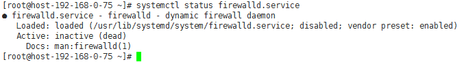
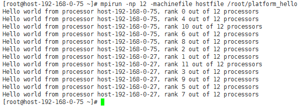

# 在HPC集群上运行Platform MPI

## 操作场景

该任务指导用户在ECS集群（以CentOS7.3为例）上运行Platform MPI应用（以版本platform\_mpi-09.01.04.03r-ce为例）。

## 前提条件

-   已成功创建带IB网卡的弹性云服务器，并绑定了弹性IP进行登录。
-   已使用私有镜像创建多个弹性云服务器。

## 操作步骤

1.  关闭防火墙。
    1.  登录集群中任意一台ECS。
    2.  执行以下命令，关闭ECS防火墙。

        **\# systemctl stop firewalld.service**

    3.  执行以下命令，查看防火墙是否关闭成功。

        \#  **systemctl status firewalld.service**

        **图 1**  关闭防火墙成功  
        

    4.  依次登录集群中所有ECS，重复执行[步骤1.1](#li41451650203628)～[步骤1.3](#li39164885203628)，关闭所有ECS的防火墙。

2.  修改配置文件。
    1.  登录集群中任意一台ECS。
    2.  执行以下命令，查看ECS的主机名。

        **\# hostname**

        **图 2**  查看ECS的主机名  
        

    3.  依次登录集群中所有ECS，重复执行[步骤2.1](#li16885562203628)～[步骤2.2](#li17752331203628)，获取所有ECS的主机名。
    4.  登录集群中任意一台ECS。
    5.  执行以下命令，添加hosts配置文件。

        **\# vi /etc/hosts**

        添加的内容为集群中所有ECS的私网IP和主机名，例如：

        **192.168.0.1 host-192-168-0-1**

        **192.168.0.2  **host-192-168-0-**2**

        **...**

    6.  执行以下命令，添加hostfile文件。

        **$vi hostfile**

        添加集群中所有ECS的主机名，例如：

        **host-192-168-0-1**

        **host-192-168-0-1**

        **...**

    7.  依次登录集群中所有ECS，重复执行[步骤2.4](#li63876522203628)～[步骤2.6](#li28886600203628)。

3.  配置IB网卡的IP地址。
    1.  对集群中所有的ECS，执行以下命令，为IB驱动配置IP地址。

        **\# ifconfig ib0  _192.168.23.34_/24**

        **\# ifconfig ib0  _192.168.23.35_/24**

        **...**

        > **说明：**   
        >IP地址可随意指定，但需要在同一网段内。  

    2.  在ECS中使用以下命令，验证连通性。

        **\# ping  _192.168.23.35_**

4.  执行以下命令，在ECS集群运行Platform MPI。

    以两台ECS为例：

    **\# mpirun -perhost 2 -np 12 -machinefile hostfile /root/platform\_hello**

    > **说明：**   
    >hostfile文件在运行时需要指定路径，可执行文件hello路径须为绝对路径，集群中所有可执行文件在同一路径下。  

    **图 3**  集群上运行Platform MPI成功  
    

