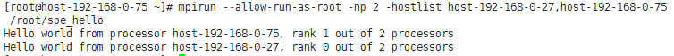

# 在HPC集群上运行Spectrum MPI

## 操作场景

该任务指导用户在已配置好的弹性云服务器上，运行Spectrum MPI应用（IBM Spectrum MPI v10.1）。

## 前提条件

-   已成功创建带IB网卡的弹性云服务器，并绑定了弹性IP进行登录。
-   已使用私有镜像创建多个弹性云服务器。

## 操作步骤

1.  使用“PuTTY”，采用密钥对方式登录弹性云服务器。

    登录用户为创建弹性云服务器时指定的用户名。

2.  执行以下命令，防止系统超时退出。

    **\# TMOUT=0**

3.  执行以下命令，验证参加测试的弹性云服务器之间是否可以免密码互相登录。

    $  **ssh** _**用户名**_**@_SERVER\_IP_**

4.  执行以下命令，关闭弹性云服务器的防火墙。

    **\# iptables -F**

    **\# service firewalld stop**

5.  执行以下命令，用“IP:Number“的形式作为MPI集群运行程序时的hostlist参数，在集群上通过Spectrum MPI运行可执行文件。其中，

    -   IP代表集群中的弹性云服务器IP地址。
    -   Number代表该弹性云服务器的任务数。

    假设集群中共有两个弹性云服务器，主机名分别是host-192-168-0-27和host-192-168-0-75，可执行程序的目录为/root/spe\_hello，文件名为spe\_hello，则命令行如下：

    **\# mpirun --allow-run-as-root -np 2 -hostlist host-192-168-0-27,host-192-168-0-75 /root/spe\_hello**

    **图 1**  在集群上通过Spectrum MPI运行可执行文件  
    

    > **说明：**   
    >hostfile文件在运行时需要指定路径，可执行文件hello路径须为绝对路径，集群中所有可执行文件在同一路径下。  

