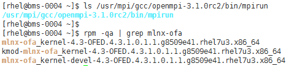
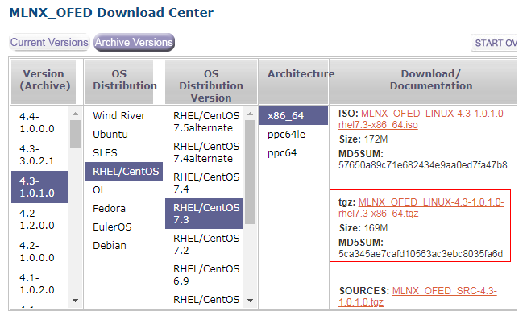
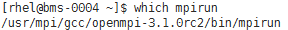
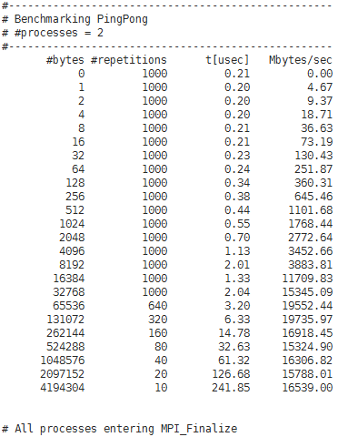

# 安装和使用IB驱动自带的Open MPI

## 操作场景

本节指导用户在BMS上安装和使用IB驱动自带的Open MPI（以版本3.1.0rc2为例）。

对于集群中的每台BMS，都需要执行该操作。

## 前提条件

已配置BMS集群间互相免密登录。

## 操作步骤

1.  查询是否安装了IB驱动。
    1.  执行以下命令，查询是否已成功安装IB驱动。

        **$ ls /usr/mpi/gcc/openmpi-3.1.0rc2/bin/mpirun**

        **$ rpm -qa | grep mlnx-ofa**

        **图 1**  确认已安装IB驱动  
        

    2.  查看回显结果。
        -   如果回显如[图1](#fig17357957101819)所示，表示已安装IB驱动，执行[3](#li773103104927)。
        -   如果未安装IB驱动，执行[2](#li48212760104917)。

2.  安装IB驱动。
    1.  下载安装包“MLNX\_OFED\_LINUX-4.3-1.0.1.0-rhel7.3-x86\_64.tgz”。

        下载地址：[http://www.mellanox.com/page/products\_dyn?product\_family=26&mtag=linux\_sw\_drivers](http://www.mellanox.com/page/products_dyn?product_family=26&mtag=linux_sw_drivers)

        **图 2**  IB驱动的下载页面  
        

    2.  执行以下命令，安装软件包。

        **\# yum install tk tcl**

        **\# tar -xvf MLNX\_OFED\_LINUX-4.3-1.0.1.0-rhel7.3-x86\_64.tgz**

        **\# cd MLNX\_OFED\_LINUX-**4.3-1.0.1.0-rhel7.3**-x86\_64**

        **\# ./mlnxofedinstall**

3.  配置环境变量。
    1.  使用vim编辑“\~/.bashrc”文件，添加如下配置内容：

        **export PATH=$PATH:/usr/mpi/gcc/openmpi-**3.1.0rc2**/bin**

        **export LD\_LIBRARY\_PATH=/usr/mpi/gcc/openmpi-**3.1.0rc2**/lib64**

    2.  执行以下命令，查看MPI环境变量是否正常。

        **$ which mpirun**

        **图 3**  查看IB驱动自带的Open MPI环境变量  
        

        如果回显如[图3](#fig37650618112345)所示，表示环境变量配置成功。

4.  执行以下命令，在单台BMS上运行IB驱动自带的Open MPI。

    **$ mpirun -np 2 -mca btl\_openib\_if\_include "mlx5\_0:1" -x MXM\_IB\_USE\_GRH=y /usr/mpi/gcc/openmpi-**3.1.0rc2**/tests/imb/IMB-MPI1 PingPong**

    **图 4**  单台BMS上运行Open MPI  
    

