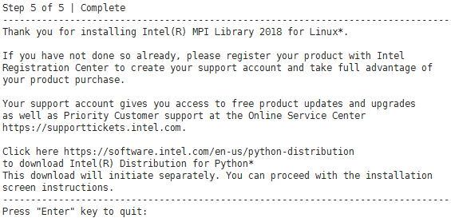
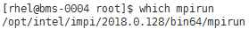
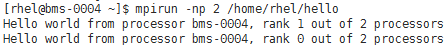

# 安装和使用Intel MPI

## 操作场景

本节指导用户在BMS集群上安装和使用Intel MPI应用（以版本l\_mpi\_2018.0.128为例）。

对于集群中的每台BMS，都需要执行该操作。

## 前提条件

已配置BMS集群间互相免密登录。

## 操作步骤

1.  安装Intel MPI。
    1.  下载Intel MPI。

        下载地址：[https://software.intel.com/en-us/intel-mpi-library](https://software.intel.com/en-us/intel-mpi-library)

    2.  执行以下命令，解压并安装Intel MPI。

        以l\_mpi\_2018.0.128.tgz为例：

        **\# tar -xvf l\_mpi\_2018.0.128.tgz**

        **\# cd l\_mpi\_2018.0.128/**

        **\# ./install.sh**

        **图 1**  Intel MPI成功安装  
        

2.  配置环境变量。
    1.  普通用户下，在“\~/.bashrc“中添加：

        **export PATH=$PATH:/opt/intel/impi/2018.0.128/bin64**

        **export LD\_LIBRARY\_PATH=/opt/intel/impi/**2018.0.128**/lib64**

    2.  执行下列命令，导入环境变量。

        **$ source \~/.bashrc**

3.  执行下列命令，查看是否导入成功。

    **$ which mpirun**

    **图 2**  Intel MPI环境变量导入成功  
    

    回显结果如[图2](#fig5191097717015)所示，表示环境变量导入成功。

4.  执行以下命令，在单个BMS上运行Intel MPI。
    1.  执行以下命令，生成可执行文件。

        **$ mpicc hello.c -o hello**

    2.  执行以下命令，在单个BMS上运行Intel MPI。

        **$ mpirun -np 2 /home/rhel/hello**

        **图 3**  在单个BMS上运行Intel MPI  
        

