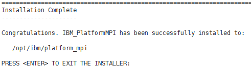
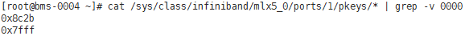
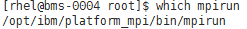
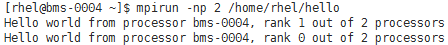

# 安装和使用Platform MPI

## 操作场景

本节指导用户在BMS集群上安装和使用Platform MPI应用（以版本platform\_mpi- 09.01.04.03r-ce.bin为例）。

对于集群中的每台BMS，都需要执行该操作。

## 前提条件

已配置BMS集群间互相免密登录。

## 操作步骤

1.  安装Platform MPI
    1.  下载platformMPI，如：platform\_mpi- 09.01.04.03r-ce.bin。
    2.  执行以下命令，安装依赖包。

        **\# yum install glibc.i686 libgcc-4.8.5-11.el7.i686 libgcc\_s.so.1**

    3.  执行以下命令，增加执行权限。

        **\#chmod +x platform\_mpi-09.01.04.03r-ce.bin**

    4.  安装Platform MPI。

        **\# ./platform\_mpi-09.01.04.03r-ce.bin**

        根据系统提示安装Platform MPI，默认安装到“/opt/ibm/platform\_mpi“文件夹下。

        **图 1**  Platform MPI成功安装  
        

2.  配置环境变量。
    1.  执行以下命令，获取pkey。

        **\# cat /sys/class/infiniband/mlx5\_0/ports/1/pkeys/\* | grep -v 0000**

        **图 2**  获取pkey  
        

    2.  普通用户下，在\~/.bashrc中添加：

        **export MPI\_ROOT=/opt/ibm/platform\_mpi**

        **export PATH=$MPI\_ROOT/bin:$PATH**

        **export LD\_LIBRARY\_PATH=/opt/ibm/platform\_mpi/lib/linux\_amd64**

        **export MPI\_IB\_PKEY=**_[2.a](#li43811143171922)__中获取的pkey_

        **$source  \~/.bashrc**

        > **说明：**   
        >如果存在多个pkey，使用英文逗号隔开。  

    3.  执行以下命令，检查环境变量是否配置成功。

        **\# which mpirun**

        **图 3**  检查环境变量  
        

3.  在单个BMS上运行Platform MPI。
    1.  执行以下命令，重新编译hello.c文件。

        **$ mpicc hello.c -o hello**

    2.  执行以下命令，在单个BMS上运行Platform MPI。

        **$ mpirun -np 2 /home/rhel/hello**

        **图 4**  在单台BMS上运行Platform MPI  
        

