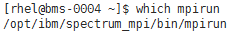
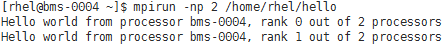

# 安装和使用Spectrum MPI

## 操作场景

本节指导用户在BMS集群上安装和使用Spectrum MPI应用（以版本10.01.01为例）。

对于集群中的每台BMS，都需要执行该操作。

## 背景信息

IBM Spectrum MPI v10.1版本当前支持的操作系统列表如下：

-   **IBM Spectrum MPI 10.1.0.1 Eval for x86\_64 Linux**
    -   Red Hat Enterprise Linux version 6.6及其之后的版本
    -   Red Hat Enterprise Linux version 7.1及其之后的版本
    -   SUSE Linux Enverprise Server version 11 SP4
    -   SUSE Linux Enverprise Server version 12及其之后的版本

-   **IBM Spectrum MPI 10.1.0.2 Eval for Power 8 Linux**

    Red Hat Enterprise Linux version 7.3及其之后的版本

## 前提条件

已配置BMS集群间互相免密登录。

## 操作步骤

1.  安装Spectrum MPI。
    1.  获取IBM Spectrum MPI软件包，需要进行注册。

        获取的IBM Spectrum MPI软件包有两个，包括license和软件两部分：

        -   ibm\_smpi\_lic\_s-10.1Eval-rh7\_Aug11.x86\_64.rpm
        -   ibm\_smpi-10.01.01.0Eval-rh7\_Aug11.x86\_64.rpm

        下载地址：[https://www-01.ibm.com/marketing/iwm/iwm/web/preLogin.do?source=swerpsysz-lsf-3](https://www-01.ibm.com/marketing/iwm/iwm/web/preLogin.do?source=swerpsysz-lsf-3)

    2.  安装IBM Spectrum MPI。
        1.  将[1.a](#li42894275161236)中下载的MPI软件包上传至运行MPI的BMS内（建议“/home/rhel“目录下）。
        2.  执行以下命令，设置环境变量。
            -   如果选择自动接受IBM Spectrum MPI安装许可协议，执行以下命令：

                **\# export IBM\_SPECTRUM\_MPI\_LICENSE\_ACCEPT=yes**

            -   如果选择手动接受IBM Spectrum MPI安装许可协议，执行以下命令：

                **\# export IBM\_SPECTRUM\_MPI\_LICENSE\_ACCEPT=no**

        3.  安装License部分。
            -   选择自动接受IBM Spectrum MPI安装许可协议的，执行以下命令：

                **\# rpm -ivh ibm\_smpi\_lic\_s-10.1Eval-rh7\_Aug11.x86\_64.rpm**

            -   选择手动接受IBM Spectrum MPI安装许可协议的，执行以下命令：

                **\# rpm -ivh ibm\_smpi\_lic\_s-10.1Eval-rh7\_Aug11.x86\_64.rpm**

                **\# sh /opt/ibm/spectrum\_mpi/lap\_se/bin/accept\_spectrum\_mpi\_license.sh**

        4.  安装软件部分。

            **\# rpm -ivh ibm\_smpi-10.01.01.0Eval-rh7\_Aug11.x86\_64.rpm**

2.  配置环境变量。
    1.  默认情况下，Spectrum MPI会安装至“/opt/ibm/spectrum\_mpi”目录。该场景下需要设置如下环境变量：

        **$ export MPI\_ROOT=/opt/ibm/spectrum\_mpi**

        **$ export LD\_LIBRARY\_PATH=$MPI\_ROOT/lib:$LD\_LIBRARY\_PATH**

        **$ export PATH=$MPI\_ROOT/bin:$PATH**

        **$ export MANPATH=$MPI\_ROOT/share/man:$MANPATH**

        **$ unset MPI\_REMSH**

    2.  执行以下命令，查看MPI环境变量是否正常。

        **$ which mpirun**

        **图 1**  检查MPI环境变量  
        

3.  在单个BMS上通过Spectrum MPI运行可执行文件。
    1.  假设hello.c文件在“/home/rhel/”目录下，生成的可执行文件名为hello，执行以下命令：

        **$** **cd** **/home/rhel/**

        **$ mpicc hello.c -o hello**

    2.  执行以下命令，在单个BMS上通过Spectrum MPI运行可执行文件。

        **$ mpirun -np 2 /home/rhel/hello**

        **图 2**  单BMS上运行Spetrum MPI成功  
        

