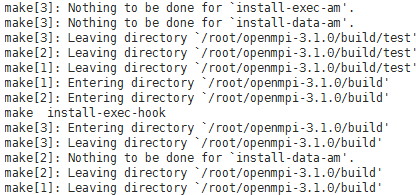

# 安装和使用社区OpenMPI<a name="ZH-CN_TOPIC_0075662278"></a>

## 操作场景<a name="section5226638417947"></a>

本节指导用户在BMS上安装和使用社区OpenMPI（以3.1.1版本为例）。

对于集群中的每台BMS，都需要执行该操作。

## 前提条件<a name="section22262618171127"></a>

已配置BMS集群间互相免密登录。

## 操作步骤<a name="section57484283145925"></a>

1.  安装HPC-X工具套件。
    1.  使用社区OpenMPI时，需要同时使用Mellanox的HPC-X 套件，适用于CentOS 7.3的HPC-X版本是“hpcx-v2.2.0-gcc-MLNX\_OFED\_LINUX-4.3-1.0.1.0-redhat7.3-x86\_64.tbz”。

        下载地址：[http://www.mellanox.com/page/products\_dyn?product\_family=189&mtag=hpc-x](http://www.mellanox.com/page/products_dyn?product_family=189&mtag=hpc-x)

    2.  将下载的软件包拷贝到BMS内（建议在“/home/rhel“目录下）。
    3.  执行以下命令，解压HPC-X工具套件，并修改HPC-X工具套件目录。

        **\# tar -xvf hpcx-v2.2.0-gcc-MLNX\_OFED\_LINUX-4.3-1.0.1.0-redhat7.3-x86\_64.tbz**

        **\# mv hpcx-v2.2.0-gcc-MLNX\_OFED\_LINUX-4.3-1.0.1.0-redhat7.3-x86\_64 /opt/hpcx-v2.2.0**

2.  安装OpenMPI。
    1.  下载社区OpenMPI，版本号为“openmpi-3.1.0.tar.gz”。

        下载地址：[https://www.open-mpi.org/software/ompi/v3.1/](https://www.open-mpi.org/software/ompi/v3.1/)

    2.  将下载的OpenMPI压缩包拷贝至BMS内（建议在“/home/rhel“目录下）。
    3.  执行以下命令，解压软件包。

        **\# tar -xzvf openmpi-3.1.0.tar.gz**

        **\# cd openmpi-3.1.0**

    4.  执行以下命令，安装所需要的库文件，安装之前请确保BMS能与外网连通。
        1.  执行以下命令，安装依赖包。

            **\# yum install binutils-devel.x86\_64 gcc-c++** **autoconf automake libtool**

            **图 1**  安装binutils-devel.x86\_64等依赖包成功<a name="fig12484891154724"></a>  
            

    5.  执行以下命令，安装编译OpenMPI。

        **\# ./autogen.pl**

        **\# mkdir build && cd build**

        **\# ../configure --prefix=/opt/openmpi-310 --with-mxm=/opt/hpcx-v2.2.0/mxm**

        **\# make all install**

        **图 2**  OpenMPI安装成功<a name="fig57554999154724"></a>  
        

3.  配置MPI环境变量。
    1.  普通用户下，在“\~/.bashrc”中添加如下环境变量：

        **export PATH=$PATH:/opt/openmpi-310/bin**

        **export LD\_LIBRARY\_PATH=$LD\_LIBRARY\_PATH:/opt/openmpi-310/lib**

    2.  执行以下命令，导入配置的MPI环境变量。

        **$ source \~/.bashrc**

    3.  执行以下命令，查看MPI环境变量是否正常。

        **$ which mpirun**

        **图 3**  环境变量正常<a name="fig38292731154724"></a>  
        

        回显如[图3](#fig38292731154724)所示表示环境变量正常。

4.  执行以下命令，在单个BMS上运行社区OpenMPI。
    1.  执行以下命令，生成可执行文件。

        **$ cd**  \~

        **$ vi hello.c**

        编辑内容如下：

        ```
        #include<mpi.h>   
        #include<stdio.h>   
        int main(int argc, char** argv){
               //Initialize the MPI environment
               MPI_Init(NULL, NULL);
               //Get the number of processes
               int world_size;
               MPI_Comm_size(MPI_COMM_WORLD, &world_size);
               //Get the rank of the process
               int world_rank;
               MPI_Comm_rank(MPI_COMM_WORLD, &world_rank);
               //Get the name of the processor
               char processor_name[MPI_MAX_PROCESSOR_NAME];
               int name_len;
               MPI_Get_processor_name(processor_name, &name_len);
               //Print off a hello world message.
               printf("Hello world from processor %s, rank %d"" out of %d processors\n",processor_name, world_rank, world_size);
               //Finalize the MPI environment.
               MPI_Finalize();
           }
        ```

        **$ mpicc hello.c -o hello**

        > **须知：**   
        >不同版本的MPI运行的hello文件是不同的，都需要使用命令**mpicc hello.c -o hello**对hello.c文件重新编译。  

    2.  执行以下命令，在单个BMS上运行社区OpenMPI。

        **$ mpirun -np 2 /home/rhel/hello**

        **图 4**  社区OpenMPI运行成功<a name="fig1895666115496"></a>  
        

        回显如[图4](#fig1895666115496)所示，表示单个BMS上运行社区OpenMPI成功。


