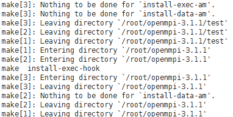

# 社区OpenMPI<a name="ZH-CN_TOPIC_0063425437"></a>

## 操作场景<a name="section5226638417947"></a>

本节指导用户安装和使用社区OpenMPI（以3.1.1版本的OpenMPI为例）。

## 前提条件<a name="section22262618171127"></a>

已配置弹性云服务器免密登录。

## 操作步骤<a name="section54197928171645"></a>

1.  安装HPC-X工具套件。
    1.  下载需要的HPC-X工具套件以及OpenMPI。

        使用社区OpenMPI时，需要同时使用Mellanox的HPC-X 套件，HPC-X 的下载需要参考弹性云服务器操作系统的版本以及IB驱动版本，例如，下载的HPC-X版本为：hpcx-v2.0.0-gcc-MLNX\_OFED\_LINUX-4.2-1.2.0.0-redhat7.3-x86\_64.tbz。

    2.  执行以下命令，解压HPC-X工具套件。

        **\# tar -xvf hpcx-v**2.0.0**-gcc-MLNX\_OFED\_LINUX-4.2-1.2.0.0-redhat7.3-x86\_64.tbz**

    3.  （可选）执行以下命令，修改HPC-X工具套件的目录。

        **\# mv  hpcx-v**2.0.0**-gcc-MLNX\_OFED\_LINUX-4.2-1.2.0.0-redhat7.3-x86\_64.tbz /opt/hpcx-v**2.0.0****


2.  安装OpenMPI。
    1.  将下载的OpenMPI压缩包（以openmpi-3.1.1.tar.gz为例）拷贝至弹性云服务器内，并执行以下命令进行解压。

        **\# tar -xzvf openmpi-3.1.1.tar.gz**

        **\# cd openmpi-3.1.1**

    2.  执行以下命令，安装需要的库文件。

        **\# yum install binutils-devel.x86\_64** **libibverbs-devel**

    3.  执行以下命令，编译安装OpenMPI。

        **\# ./autogen.pl**

        **\# mkdir build**

        **\# cd build**

        **\# ../configure --prefix=/opt/openmpi-311 --with-mxm=/opt/hpcx-v2.0.0/mxm**

        ****\#**  make all install**

        **图 1**  安装OpenMPI<a name="fig15516095175243"></a>  
        

        系统回显的安装过程如[图1](#fig15516095175243)所示，且退出后无报错，说明安装OpenMPI成功。


3.  配置MPI环境变量。
    1.  在“\~/.bashrc“添加如下环境变量：

        **export PATH=$PATH:/opt/openmpi-311/bin**

        **export LD\_LIBRARY\_PATH=$LD\_LIBRARY\_PATH:/opt/openmpi-311/lib**

    2.  执行以下命令，导入配置的MPI环境变量。

        **\# source \~/.bashrc**

    3.  执行以下命令，查看MPI环境变量是否正常。

        **\# which mpirun**

        **图 2**  查看社区OpenMPI环境变量<a name="fig10006482175243"></a>  
        

        系统回显结果如[图2](#fig10006482175243)所示，则环境配置正常。


4.  执行以下命令，在单个弹性云服务器上运行Intel MPI benchmark。

    **$ mpirun --allow-run-as-root -np 2 /usr/mpi/gcc/openmpi-3.0.0rc6/tests/imb/IMB-MPI1 PingPong**

    系统回显如下：

    ```
    #------------------------------------------------------------
    #    Intel (R) MPI Benchmarks 4.1, MPI-1 part
    #------------------------------------------------------------
    # Date                  : Mon Jul 16 09:38:20 2018
    # Machine               : x86_64
    # System                : Linux
    # Release               : 3.10.0-514.10.2.el7.x86_64
    # Version               : #1 SMP Fri Mar 3 00:04:05 UTC 2017
    # MPI Version           : 3.1
    # MPI Thread Environment:
    
    # New default behavior from Version 3.2 on:
    
    # the number of iterations per message size is cut down
    # dynamically when a certain run time (per message size sample)
    # is expected to be exceeded. Time limit is defined by variable
    # "SECS_PER_SAMPLE" (=> IMB_settings.h)
    # or through the flag => -time
    
    # Calling sequence was:
    
    # /usr/mpi/gcc/openmpi-3.0.0rc6/tests/imb/IMB-MPI1 PingPong
    
    # Minimum message length in bytes:   0
    # Maximum message length in bytes:   4194304
    #
    # MPI_Datatype                   :   MPI_BYTE
    # MPI_Datatype for reductions    :   MPI_FLOAT
    # MPI_Op                         :   MPI_SUM
    #
    #
    
    # List of Benchmarks to run:
    
    # PingPong
    
    #---------------------------------------------------
    # Benchmarking PingPong
    # #processes = 2
    #---------------------------------------------------
    #bytes #repetitions      t[usec]   Mbytes/sec
    0         1000         0.23         0.00
    1         1000         0.23         4.06
    2         1000         0.24         8.04
    4         1000         0.24        16.19
    8         1000         0.24        32.29
    16         1000         0.24        64.06
    32         1000         0.27       114.46
    64         1000         0.27       229.02
    128         1000         0.37       333.48
    256         1000         0.46       535.83
    512         1000         0.52       944.51
    1024         1000         0.63      1556.77
    2048         1000         0.83      2349.92
    4096         1000         1.35      2896.07
    8192         1000         2.29      3415.98
    16384         1000         1.46     10727.65
    32768         1000         2.08     15037.62
    65536          640         3.53     17691.38
    131072          320         6.52     19159.59
    262144          160        15.62     16002.93
    524288           80        31.37     15938.06
    1048576           40        61.78     16185.93
    2097152           20       124.04     16124.41
    4194304           10       242.42     16500.33
    
    # All processes entering MPI_Finalize
    ```


