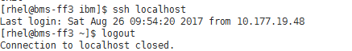

# 配置BMS集群互相免密登录

## 操作场景

该任务指导用户在BMS集群上进行相关设置，并使其可以相互免密登录。

## 背景信息

$：表示在普通用户下，执行相关操作。

\#：表示在超级用户下，执行相关操作。

普通用户切换至超级用户，请使用命令**sudo su**。

## 前提条件

已成功创建BMS，并绑定了弹性IP进行登录。

## 操作步骤

1.  使用“PuTTY”，采用密钥对方式登录集群中任意一台BMS。
2.  执行以下命令，防止系统超时退出。

    **\# TMOUT=0**

3.  将BMS对应的密钥文件（.pem文件）拷贝至.ssh目录下，命名为“id\_rsa”。

    **$ cd \~/.ssh**

    **$ mv \*.pem id\_rsa**

4.  执行以下命令，给密钥文件配置权限。

    **$ sudo chmod 600 id\_rsa**

5.  执行以下命令，ssh方式登录本节点，验证是否可以不输入密码登录BMS。

    **$ ssh localhost**

    **图 1**  免密登录BMS  
    

    系统回显结果如[图1](#fig21785809102715)所示，可以无密钥登录本节点，表示权限配置成功。

6.  依次登录集群中其他BMS，重复执行步骤[1](#li25723347101345)～[5](#li3031934810244)。
7.  执行以下命令，验证参加测试的BMS之间是否可以免密码互相登录。

    $  **ssh** _**用户名**_**@**_**SERVER\_IP**_

